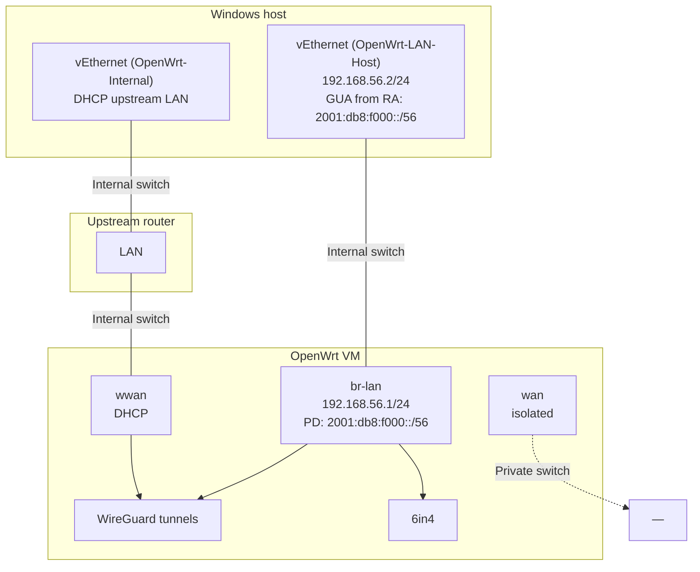

[Русский](OPENWRT_DEV_INFRASTRUCTURE.ru.md) | [English](OPENWRT_DEV_INFRASTRUCTURE.en.md) | **Deutsch**

# OpenWrt dev lab — mwan3-Integrationstests

> **Zweck:** Beschreibung einer typischen Laborumgebung (Hyper-V + OpenWrt-VM) zum Debuggen von **mwan3** und **mwan6-npt** vor dem Rollout in die Production.  
> **IPv6 in diesem Dokument:** ausschließlich **fiktive** Präfixe (`2001:db8:…`, `fd00:db8:…`).

Dieses Dokument und das PowerShell-Skript werden mit dem **mwan3**-Paket ausgeliefert:

| Artefakt | Pfad nach Paketinstallation auf OpenWrt |
|----------|----------------------------------------|
| Dieses Dokument (RU) | `/usr/share/doc/mwan3/OPENWRT_DEV_INFRASTRUCTURE.ru.md` |
| Dieses Dokument (EN) | `/usr/share/doc/mwan3/OPENWRT_DEV_INFRASTRUCTURE.en.md` |
| Dieses Dokument (DE) | `/usr/share/doc/mwan3/OPENWRT_DEV_INFRASTRUCTURE.de.md` |
| Schnelltest der Policies | `/usr/share/doc/mwan3/integration/Test-Mwan3PolicySwitch.ps1` |
| Umfassender Kanaltest | `/usr/share/doc/mwan3/integration/Test-Mwan3ChannelSwitch.ps1` |

Skript auf den **Windows-Host** kopieren (OpenWrt führt es nicht aus). Erfordert PowerShell 5.1+, SSH-Client, Zugriff auf die LAN-VM vom Host aus.

---

## Beteiligte

| Knoten | Rolle |
|--------|-------|
| **Windows host** | Hyper-V, SSH-Client, PowerShell-Tests vom LAN-Adapter |
| **OpenWrt VM** | OpenWrt mit Multi-WAN IPv6 (WireGuard / 6in4, mwan3, mwan6-npt) |
| **Upstream LAN** (optional) | Physischer Router oder zweites Segment für die WWAN-NIC der VM |

---

## Hyper-V: virtuelle Switches

| Switch (Beispiel) | Typ | vEthernet auf Windows | Zweck |
|-------------------|-----|----------------------|-------|
| **OpenWrt-LAN-Host** | Internal | `vEthernet (OpenWrt-LAN-Host)` | VM **lan** — SSH, ping vom Host |
| **OpenWrt-Internal** | Internal | `vEthernet (OpenWrt-Internal)` | VM **wwan**, Zugriff auf Upstream-LAN |
| **OpenWrt-WAN-Isolated** | Private | *(auf dem Host nicht vorhanden)* | nur VM **wan** |

Adapter auf dem Host prüfen:

```powershell
Get-NetAdapter | Where-Object InterfaceDescription -match 'Hyper-V' |
    Select-Object Name, InterfaceDescription, Status
```

---

## Schnittstellenübersicht (Beispiel)



### VM-NICs (Beispiel)

| OpenWrt iface | Switch | vEthernet Windows | IPv4 (Beispiel) | IPv6 (fiktiv) |
|---------------|--------|-------------------|---------------|---------------|
| **lan** / `br-lan` | OpenWrt-LAN-Host | `vEthernet (OpenWrt-LAN-Host)` | VM `.1/24`, host `.2` | PD `2001:db8:f000::/56`, RA |
| **wan** | OpenWrt-WAN-Isolated | — | — | — |
| **wwan** | OpenWrt-Internal | `vEthernet (OpenWrt-Internal)` | DHCP | über Upstream |

---

## Logische OpenWrt-Schnittstellen (IPv6 — fiktiv)

| Schnittstelle | Typ | `wan_prefix` (Beispiel) | NPT vs LAN `2001:db8:f000::/56` |
|---------------|-----|-------------------------|----------------------------------|
| **lan** | bridge | PD-Quelle | — |
| **tb62** | WireGuard | `2001:db8:62::/56` | **NPT** |
| **tb63** | WireGuard | `2001:db8:63::/56` | **NPT** |
| **tb64** | WireGuard | `2001:db8:f000::/56` | **identity** (ohne NPT) |
| **tb65** | WireGuard | `2001:db8:65::/56` | **NPT** |
| **tb66** | WireGuard | `2001:db8:66::/56` | **NPT** |
| **tb67** | WireGuard (ULA) | `fd00:db8:67::/64` | **NPT** |
| **henet** | 6in4 | `2001:db8:734a::/48` | **NPT** |

**mwan6-npt:** NPT wird aktiviert, wenn `LAN_PREFIX ≠ wan_prefix`; Neuerstellung bei **ifup/ifdown** des Tunnels und bei Änderungen in UCI/network (PD).

---

## PowerShell: `Test-Mwan3PolicySwitch.ps1`

### Vorbereitung auf Windows

```powershell
# Vom Router kopieren (Beispiel)
scp root@<dev-lan-ip>:/usr/share/doc/mwan3/integration/Test-Mwan3PolicySwitch.ps1 $env:USERPROFILE\mwan3-lab\
cd $env:USERPROFILE\mwan3-lab
```

### LAN source

Parameter **`-LanInterface`** — Name des Windows-Adapters, über den der Host ins Dev-Netz geht.

Auf der Schnittstelle wird **genau eine** GUA erwartet (`Preferred`, kein link-local / ULA / multicast). Das Skript liest sie über `Get-NetIPAddress`.

```powershell
Get-NetIPAddress -InterfaceAlias '<your-lan-adapter>' -AddressFamily IPv6 |
    Where-Object { $_.AddressState -eq 'Preferred' -and $_.IPAddress -notmatch '^(fe80:|ff|::|fd[0-9a-f]{2}:)' }
```

### Was es tut

1. SSH auf OpenWrt (`-DevHost`, `-DevUser`)
2. Schaltet `mwan3.default_rule_v6.use_policy` (`-Policies`)
3. **Router:** `ping6` ohne `-I` (policy routing)
4. **Windows:** `ping -6 -S <GUA>` über `-LanInterface`
5. Optional `-HttpCheck`: egress IP → Zuordnung zum Tunnel

### Beispiele

```powershell
.\Test-Mwan3PolicySwitch.ps1 `
    -DevHost 192.168.56.1 `
    -LanInterface 'vEthernet (OpenWrt-LAN-Host)'

.\Test-Mwan3PolicySwitch.ps1 `
    -DevHost 192.168.56.1 `
    -LanInterface 'vEthernet (OpenWrt-LAN-Host)' `
    -Policies ipv6_tb62,ipv6_tb66 `
    -HttpCheck
```

Parameter `-DevHost`, `-LanInterface`, `-Policies` sind an Ihr Lab-Netz anzupassen.

---

## PowerShell: `Test-Mwan3ChannelSwitch.ps1` (umfassend)

Erweitertes Szenario zur **Prüfung des IPv6-Kanalwechsels** mit Verkehrsverifikation auf mehreren Ebenen, einschließlich **tcpdump** auf der Tunnelschnittstelle.

### Unterschied zu `Test-Mwan3PolicySwitch.ps1`

| | `Test-Mwan3PolicySwitch.ps1` | `Test-Mwan3ChannelSwitch.ps1` |
|---|---|---|
| Umschalten `default_rule_v6` | ja | ja |
| Ping (Router + Windows) | ja | ja |
| HTTP egress → tunnel map | optional (`-HttpCheck`) | **standardmäßig** (`-SkipHttpCheck` deaktiviert) |
| **tcpdump** auf `tb*` | nein | **ja** (`-SkipTcpDump` deaktiviert) |
| Präfixprüfung src in pcap | nein | **ja** (Registry: `wan_prefix`, SNAT, addr) |
| Leak auf benachbarte tb | nein | optional (`-CheckLeakOnOtherTunnels`) |

### Abhängigkeiten auf der OpenWrt-VM

```sh
apk add tcpdump    # obligatorisch für pcap-Phase
# curl — für HTTP egress (in der Regel bereits vorhanden)
```

### Vorbereitung auf Windows

```powershell
scp root@<dev-lan-ip>:/usr/share/doc/mwan3/integration/Test-Mwan3ChannelSwitch.ps1 $env:USERPROFILE\mwan3-lab\
cd $env:USERPROFILE\mwan3-lab
Get-NetAdapter | Where-Object Status -eq 'Up'   # Name für -LanInterface
```

### Testmethodik {#testmethodik}

Der Test führt für **jede** Policy aus `-Policies` die Phasen **sequenziell** aus. Nach allen Policies stellt das Skript `ipv6_primary` wieder her.

#### Phase 0 — Vorbereitung (einmal)

1. **Tunnel registry** per SSH vom Router laden:
   - Adressen auf `tb*` / `henet` (`REG_ADDR`);
   - SNAT aus `mwan6-npt status` (`REG_SNAT`);
   - `mwan6-npt.<iface>.wan_prefix` (`REG_PREFIX`).
2. Auf Windows **eine** GUA auf `-LanInterface` ermitteln (`Get-NetIPAddress`, `Preferred`).

Die Registry dient der Zuordnung: „sichtbare egress IP / src in pcap → welcher Tunnel“.

#### Phase 1 — Policy-Umschaltung

1. `uci set mwan3.default_rule_v6.use_policy=<policy>`
2. `/etc/init.d/mwan3 restart`
3. `mwan3 flush-conntrack`, `mwan3 sync-track-routes`
4. Pause `-WaitAfterSwitchSec` (Standard 5 s)
5. Aus `mwan3 status` wird die **erwartete Schnittstelle** extrahiert (`MwanIface`, z. B. `tb62` für `ipv6_tb62`)

**Kriterium:** `POLICY_ACTIVE` stimmt mit der angeforderten Policy überein.

#### Phase 2 — L3 reachability

| Prüfung | Wie | Erwartung |
|---------|-----|-----------|
| Router tracked | `ping6` ohne `-I` zu `HostTracked` (`2606:4700:4700::1111`) | Antworten (mwan3 policy + `/128` track routes) |
| Router plain | `ping6` zu `HostPlain` (`2001:470:20::2`) | Antworten über policy table |
| Windows LAN | `ping -6 -S <GUA>` vom Host | Antworten (forward + NPT SNAT auf dem Router) |

**Kriterium:** alle drei — OK. Bei FAIL stoppt das Skript (oder fährt mit `-ContinueOnFailure` fort).

#### Phase 3 — HTTP egress (wenn nicht `-SkipHttpCheck`)

1. Router: `curl -6` zu `-HttpProbeUrls` (ipify, icanhazip, ident.me).
2. Antworttext = **sichtbare egress IPv6**.
3. Adresse wird dem Tunnel zugeordnet (iface SNAT / `wan_prefix` / addr on iface).
4. Vergleich mit **MwanIface** aus Phase 1.

**Kriterium:** `HttpMatch` = `OK <ip> -> tbXX`.  
**Wichtig:** für LAN-Clients maßgeblich ist router egress; Windows curl zeigt oft LAN GUA, nicht SNAT.

#### Phase 4 — tcpdump und Präfixe (wenn nicht `-SkipTcpDump`)

1. Auf der **erwarteten** Schnittstelle (`MwanIface`) wird gestartet:

   ```text
   tcpdump -i tbXX -n -l -c <TcpDumpCount> ip6
   ```

2. Parallel wird Verkehr erzeugt:
   - `ping6` vom Router (tracked + plain);
   - `curl -6` vom Router;
   - `ping6 -S <LAN GUA>` vom Router (Simulation von forward vom LAN).

3. Aus Zeilen `IP6 <src> > <dst>` werden **ausgehende src** geparst → Protokoll `PCAP_SRC|iface|src|dst`.

4. Jedes `src` wird über die Registry geprüft:

   ```text
   Resolve-TunnelForIp(src) == MwanIface
   ```

   D. h. src muss zum Präfix/SNAT-Adresse **dieses** tb-Kanals gehören, nicht zu einem benachbarten.

5. **Kriterium:** `TcpDump` = `OK n=<count> src=[...]` und **kein** `LEAK=`.

**Interpretation:**

| Ergebnis | Bedeutung |
|----------|-----------|
| `OK n=5 src=[2001:db8:62::…]` | auf tbXX gingen ≥1 Pakete mit src aus dem Kanalpräfix |
| `FAIL no-packets` | tcpdump hat nichts erfasst — Tunnel down, falsche iface oder Filter |
| `MISMATCH src=… map=tb63 want=tb62` | policy/NPT/Routing weichen ab |
| `LEAK=tb63:…` | bei `-CheckLeakOnOtherTunnels` landeten Pakete auf fremdem tb |

#### Phase 5 (optional) — Leak auf benachbarte tb

Mit `-CheckLeakOnOtherTunnels` wird auf **übrigen** tb aus der Registry kurz tcpdump gehört (`-c 3`).  
Jedes `PCAP_LEAK` — FAIL: Policy-Verkehr „sickert“ auf einen anderen Kanal.

### Beispiele für den Start

```powershell
# Vollständiger Durchlauf (ping + HTTP + tcpdump)
.\Test-Mwan3ChannelSwitch.ps1 `
    -DevHost 192.168.56.1 `
    -LanInterface 'vEthernet (OpenWrt-LAN-Host)'

# Zwei Policies + Leak-Prüfung
.\Test-Mwan3ChannelSwitch.ps1 `
    -Policies ipv6_tb62,ipv6_tb66 `
    -CheckLeakOnOtherTunnels

# Nur ping + tcpdump (ohne HTTP)
.\Test-Mwan3ChannelSwitch.ps1 -SkipHttpCheck

# Debug einer Policy, nicht beim ersten Fehler abbrechen
.\Test-Mwan3ChannelSwitch.ps1 `
    -Policies ipv6_tb63 `
    -ContinueOnFailure `
    -TcpDumpCount 15
```

### Typische Ausgabe

```text
Policy     : ipv6_tb62
MwanIface  : tb62
DevPing    : OK
WinPing    : OK
HttpMatch  : OK 2001:db8:62::… -> tb62
TcpDump    : OK n=8 src=[2001:db8:62::2, …]
Leak       : none
```

### Fehlerdiagnose

| Symptom | Was auf der VM prüfen |
|---------|----------------------|
| `tcpdump-not-installed` | `apk add tcpdump` |
| `FAIL no-packets` | `mwan3 status`, `wg show`, `ip -6 route show table <id>` |
| `MISMATCH` in HttpMatch / TcpDump | `mwan6-npt status`, `uci show mwan6-npt.<iface>`, `mwan3 sync-track-routes` |
| `LEAK=` | split-default `::/1` auf tb64 in main, Policy vs NPT oif |
| WinPing OK, DevPing FAIL | track `/128` routes, `globals.track_host_routes` |

Manuelle Prüfung eines Kanals auf dem Router:

```sh
IFACE=tb62
tcpdump -i "$IFACE" -n -c 5 ip6 &
ping6 -c 2 2606:4700:4700::1111
wait
uci get mwan6-npt.tb62.wan_prefix
```

---

## Testplan {#testplan}

Der Plan beschreibt **wann**, **womit** und **mit welchem Kriterium** das Lab vor Production-Änderungen geprüft wird. Skripte automatisieren Phasen; manuelle Schritte dort, wo die Automatisierung die Infrastruktur nicht abdeckt.

### Ziele

| Ziel | Erfolgskriterium |
|------|------------------|
| Policy routing | `default_rule_v6` leitet IPv6 zum gewünschten `tb*` / `henet` |
| NPT / SNAT | Egress-Adresse und src in pcap gehören zum `wan_prefix` des gewählten Kanals |
| LAN-Client | Windows mit GUA auf `-LanInterface` besteht ping über forward + NPT |
| Kanalisolation | Kein Leak auf benachbarte tb bei `-CheckLeakOnOtherTunnels` |
| Regression nach Änderungen | Alle Policies aus der Matrix — green vor APK-Rollout auf prod |

### mwan3-Modell: members → policies → rules

Im Lab geht der gesamte IPv6-Verkehr von LAN und Router (für `dest ::/0`) durch **eine Regel** `default_rule_v6`. Welcher physische Kanal gewählt wird, bestimmt die **Policy**, auf die diese Regel verweist.

```text
  UCI / LuCI                         runtime auf dem Router
  ─────────────                      ──────────────────

  config interface 'tb62'            mwan3track → online/offline
       ↓                                    ↓
  config member 'tb62_m2_w1'         metric 2, weight 1
       ↓                                    ↓
  config policy 'ipv6_tb62'    →     nur member tb62
       ↓                                    ↓
  config rule 'default_rule_v6'      nft: mark Paket → ip -6 rule
       option use_policy              lookup table N (policy table)
       'ipv6_tb62'                           ↓
                                      egress dev tb62
                                            ↓
                                      mwan6-npt SNAT (wenn LAN ≠ wan_prefix)
```

| UCI-Entität | Rolle | Beispiel im Lab |
|-------------|-------|-----------------|
| **interface** | WAN-Kanal + health-check (`track_ip`, ping) | `tb62`, `tb63`, `henet` |
| **member** | Zuordnung interface → metric/weight innerhalb der Policy | `tb62_m2_w1` → `tb62` |
| **policy** | Satz members (ein oder mehrere) | `ipv6_tb62` — nur tb62 |
| **rule** | Welches dest/family/match → welche policy | `default_rule_v6`: `::/0` → `use_policy` |

**Wichtig für Tests:** Skripte ändern nur **`mwan3.default_rule_v6.use_policy`**. Sie **ändern nicht** members, interfaces und berühren nicht `ipv4_primary` / `default_rule_v4`.

---

### Referenz IPv6-Policies (Lab) {#referenz-ipv6-politiken-lab}

Die Präfixe unten sind **fiktiv** (`2001:db8:…`), strukturell wie auf dev. Auf Ihrer VM Namen und `wan_prefix` in UCI nachschlagen.

#### `ipv6_primary` — Standard-Multi-WAN-Policy

**Zweck:** Default für `default_rule_v6` nach Tests und im normalen Lab-Betrieb. Nicht an einen tb gebunden — mwan3 wählt **dynamisch** den Uplink unter members, die per health-check **online** sind.

**Zusammensetzung (typisches dev, UCI):**

```uci
config member 'tb62_m2_w1'
	option interface 'tb62'
	option metric '2'
	option weight '1'

config member 'tb63_m3_w1'
	option interface 'tb63'
	option metric '3'
	…

config policy 'ipv6_primary'
	list use_member 'tb62_m2_w1'
	list use_member 'tb63_m3_w1'
	list use_member 'tb6_m4_w1'
	list use_member 'tb65_m5_w1'
	list use_member 'tb66_m6_w1'
```

| Parameter | Wert | Bedeutung |
|-----------|------|-----------|
| Members | tb62…tb66 (alle aktiven WG im Lab) | Kandidatenpool |
| **metric** member | 2, 3, 4, 5, 6 | **kleiner = höhere Priorität** unter online |
| **weight** | 1 (im Lab) | bei **gleichem** metric — Verkehrsanteil (Lastverteilung); bei unterschiedlichem metric — ungenutzt |
| Kanalauswahl | mwan3track online/offline | offline member **ausgeschlossen** aus policy table |

**Wie der Kanal gewählt wird (Failover ohne UCI-Wechsel):**

```text
1. mwan3track pingt track_ip jedes interface
2. interface offline → sein member gelangt nicht in die policy routing table
3. unter verbleibenden online — gewinnt member mit kleinstem metric
4. bei Wiederherstellung primary (kleineres metric) kehrt Verkehr dorthin zurück
```

**Beispiel:** online tb62 (m=2), tb63 (m=3), tb66 (m=6) → egress über **tb62**.  
tb62 offline → automatisch **tb63**. tb62 wieder online → wieder **tb62**.

**`mwan3 status` für ipv6_primary** zeigt **eine** iface — aktuellen Gewinner, z. B.:

```text
ipv6_primary:
 tb62
```

**NPT:** aktives SNAT folgt dem **tatsächlichen** egress (mwan6-npt muss rule für `oif` des gewählten tb haben). Bei Failover **wechselt** das Egress-Präfix — normal für Multi-WAN.

**Testen von ipv6_primary (L3, keine L1/L2-Matrix):**

| # | Aktion | Erwartung |
|---|--------|-----------|
| P.1 | `use_policy=ipv6_primary`, alle tb online | `mwan3 status` → tb mit **minimalem** metric (meist tb62) |
| P.2 | `ifdown tb62` (oder track offline) | status → nächster online (tb63) |
| P.3 | ping6 / curl vom LAN | egress-Präfix des **neuen** Kanals |
| P.4 | `ifup tb62` | Rückkehr zu tb62 nach recovery_interval |
| P.5 | nach Tests | PS-Skripte setzen bereits ipv6_primary |

Skripte **Test-Mwan3PolicySwitch** / **ChannelSwitch** führen ipv6_primary **nicht aus** — stellen es nur am Ende wieder her. Failover ipv6_primary — **manuell** als L3-Szenario.

**IPv4-Analog:** `ipv4_primary` — members `wwan_m1_w1` + `wan_m2_w1` (WiFi + isolated wan), gleiches metric/Failover-Prinzip für `default_rule_v4`.

#### Reservierung und Lastverteilung — der Unterschied

In einer Policy können **mehrere members** stehen. Modus bestimmen **metric** und **weight**:

| Modus | metric members | weight | Verhalten | Policy-Beispiel |
|-------|----------------|--------|-----------|-----------------|
| **Reservierung** (failover) | **unterschiedlich** (2, 3, …) | egal (meist 1) | gleichzeitig aktiv **ein** Kanal — mit kleinstem metric unter **online**; Backup nur wenn primary offline | `ipv6_tb62_tb63` |
| **Lastverteilung** | **gleich** | **unterschiedlich** (3:1, …) | beide online → Verkehr **geteilt** nach weight | `ipv6_balance_tb62_tb63` |
| **Primary pool** | unterschiedlich | 1 | wie Reservierung, aber >2 members | `ipv6_primary` |

```text
Reservierung (m=2, m=3):          Lastverteilung (m=2 w=3, m=2 w=1):
  tb62 online → 100% tb62               tb62 online + tb63 online → ~75% / ~25%
  tb62 offline → 100% tb63              einer offline → 100% auf Überlebenden
```

**PowerShell-Tests dualer Policies:** Skripte prüfen **nur den ersten Kanal** (primary — min metric, bei gleichem metric erster in `use_member`). Ping/curl/tcpdump auf dem Router laufen über `mwan3 use <primary>`. Failover auf Backup und Balance-Anteile — **L3 manuell**, nicht im automatischen L1/L2.

---

#### Policies mit zwei Kanälen (Lab)

##### `ipv6_tb62_tb63` — **Reservierung** (failover)

| Rolle | Member | Interface | metric | weight |
|-------|--------|-----------|--------|--------|
| **Primary** | `tb62_m2_w1` | tb62 | **2** | 1 |
| **Backup** | `tb63_m3_w1` | tb63 | **3** | 1 |

```uci
config policy 'ipv6_tb62_tb63'
	list use_member 'tb62_m2_w1'
	list use_member 'tb63_m3_w1'
	option last_resort 'unreachable'
```

**Verhalten:** tb62 online → gesamter Verkehr tb62; tb62 offline → tb63; beide offline → unreachable.

**L1/L2 (Skript):** nur **tb62** (`mwan3 use tb62`). **L3:** `ifdown tb62` → manuelle Prüfung tb63.

##### `ipv6_balance_tb62_tb63` — **Lastverteilung** (load share)

| Rolle | Member | Interface | metric | weight | Anteil |
|-------|--------|-----------|--------|--------|--------|
| **Primary für Test** | `tb62_bal_w3` | tb62 | **2** | **3** | ~75% |
| Second | `tb63_bal_w1` | tb63 | **2** | **1** | ~25% |

```uci
config member 'tb62_bal_w3'
	option interface 'tb62'
	option metric '2'
	option weight '3'

config member 'tb63_bal_w1'
	option interface 'tb63'
	option metric '2'
	option weight '1'

config policy 'ipv6_balance_tb62_tb63'
	list use_member 'tb62_bal_w3'
	list use_member 'tb63_bal_w1'
```

**Verhalten:** beide online → mwan3 verteilt neue flows nach weight 3:1; einer offline → 100% auf Überlebenden.

**L1/L2 (Skript):** geprüft wird **nur tb62** (erster in `use_member`), nicht Anteil 75/25. **L3:** wiederholtes `curl -6` / conntrack-Zähler — Anteile ~3:1.

**Installation auf der VM:**

```sh
# von Windows: scp + ssh, oder aus git auf WSL
scp project/mwan3/scripts/install-lab-dual-policies.sh root@192.168.56.1:/tmp/
ssh root@192.168.56.1 sh /tmp/install-lab-dual-policies.sh
```

##### Übersicht: single vs dual vs primary

| Policy | Modus | Members | L1/L2-Skript prüft |
|--------|-------|---------|---------------------|
| `ipv6_tb62` | ein Kanal | 1 | tb62 |
| `ipv6_tb62_tb63` | **Reservierung** | 2 (m≠) | **nur tb62** |
| `ipv6_balance_tb62_tb63` | **Lastverteilung** | 2 (m=, w≠) | **nur tb62** |
| `ipv6_primary` | failover pool | 5+ | nicht im PS-Durchlauf |

*(Optional: `ipv6_tb62_henet` — Reservierung WG+6in4, siehe ältere Notizen in IPV6_TUNNELBROKER_SWITCH.md.)*

---

#### Single-Channel-Policies (für L1/L2)

Jede Policy **fixiert** egress auf eine Schnittstelle — so prüft man, dass der Kanal isoliert ist und NPT/SNAT mit `wan_prefix` übereinstimmt.

| Policy | Member | Schnittstelle | `wan_prefix` (Beispiel) | NPT vs LAN `2001:db8:f000::/56` | Was geprüft wird |
|--------|--------|---------------|-------------------------|----------------------------------|------------------|
| **`ipv6_tb62`** | `tb62_m2_w1` | `tb62` | `2001:db8:62::/56` | NPT | egress/SNAT aus `/56` tb62 |
| **`ipv6_tb63`** | `tb63_m3_w1` | `tb63` | `2001:db8:63::/56` | NPT | anderes Präfix — Unterscheidung von tb62 |
| **`ipv6_tb6`** | `tb6_m4_w1` | `tb6` | `2001:db8:6::/56` | NPT | Basis-WG-Kanal |
| **`ipv6_tb65`** | `tb65_m5_w1` | `tb65` | `2001:db8:65::/64` | NPT | /64 wan_prefix (nicht /56) |
| **`ipv6_tb66`** | `tb66_m6_w1` | `tb66` | `2001:db8:66::/56` | NPT | Circuit mit separatem PD |
| **`ipv6_tb67`** | `tb67_m7_w1` | `tb67` | `fd00:db8:67::/64` | NPT (ULA) | ULA egress über ipv64 |
| **`ipv6_henet`** | `henet_m7_w1` | `henet` | `2001:db8:734a::/48` | NPT | 6in4 HE, nicht WireGuard |

Policy **`ipv6_tb64`** gibt es auf dev meist **nicht** (tb64 oft LAN PD / identity NPT). Auf prod kann tb64 einziger IPv6-Uplink sein — anderes Profil, keine Lab-Matrix.

Tatsächliche Liste auf der VM prüfen:

```sh
uci show mwan3 | grep "=policy"
for p in $(uci show mwan3 | sed -n "s/^mwan3\.\([^.]*\)=policy/\1/p"); do
  echo "=== $p ==="
  uci show mwan3.$p
  iface=$(mwan3 status 2>/dev/null | sed -n "s/^ *${p}: *//p" | head -1)
  echo "mwan3 status -> ${iface:-?}"
done
```

---

### Wie Policy-Umschaltung funktioniert

Testskripte führen auf dem Router **dieselbe Sequenz** aus (siehe `Switch-DevPolicy`):

| Schritt | Aktion | Warum |
|---------|--------|-------|
| 1 | `uci set mwan3.default_rule_v6.use_policy=<policy>` | aktive Policy für gesamtes `::/0` |
| 2 | `uci commit mwan3` | speichern |
| 3 | `/etc/init.d/mwan3 restart` | nft rules, ip rules, policy tables neu aufbauen |
| 4 | `mwan3 flush-conntrack` | alte Sessions zurücksetzen → neues mark |
| 5 | `mwan3 sync-track-routes` | `/128` zu `track_ip` wiederherstellen (IPv6 only) |
| 6 | Pause 5 s | mwan3track + hotplug mwan6-npt abwarten |

**Was sich im Kernel ändert (vereinfacht):**

```text
LAN client ping6 / router curl -6
        │
        ▼
  nft mangle: mark 0xN00  (policy table id)
        │
        ▼
  ip -6 rule: from … fwmark 0xN00 lookup table N
        │
        ▼
  ip -6 route table N: default dev tbXX
        │
        ▼
  mwan6-npt: SNAT src LAN GUA → Adresse aus wan_prefix tbXX
        │
        ▼
  tcpdump -i tbXX: src ∈ wan_prefix Kanal
```

**Was sich beim switch NICHT ändert:**

- split-default `::/1` / `8000::/1` in **main** (metric tb*) — bleibt; policy routing für **forward** vom LAN läuft über **mark**, nicht main;
- `network.*`, WireGuard keys, `mwan6-npt.*.wan_prefix` — nur wenn UCI separat geändert wurde;
- IPv4-Routen / `default_rule_v4`.

**Typische Fehler nach switch:**

| Symptom | Wahrscheinliche Ursache |
|---------|-------------------------|
| Ping OK vom Router, FAIL von Windows | NPT nicht auf `oif tbXX` umgeschaltet; stale conntrack |
| `MwanIface` korrekt, egress fremdes Präfix | mwan6-npt globals / mehrere SNAT rules |
| DevPing FAIL, WinPing OK | track `/128` fehlt → `mwan3 sync-track-routes` |
| `route get` zeigt tb64, policy tb62 | **mark path** prüfen, nicht main table |

Manuelles Umschalten (ohne Skript):

```sh
POLICY=ipv6_tb62
uci set mwan3.default_rule_v6.use_policy="$POLICY"
uci commit mwan3
/etc/init.d/mwan3 restart
mwan3 flush-conntrack
mwan3 sync-track-routes
mwan3 status | sed -n "/Current ipv6 policies:/,/Directly connected/p"
```

Wiederherstellung nach manuellen Experimenten:

```sh
uci set mwan3.default_rule_v6.use_policy=ipv6_primary
uci commit mwan3
/etc/init.d/mwan3 restart
```

---

### Details zum Testen der Policy-Umschaltung

#### Was jede Ebene prüft

| Ebene | Policy-Umschaltung | Erreichbarkeit | Egress = Kanal | L2 pcap |
|-------|:------------------:|:--------------:|:--------------:|:-------:|
| L0 | — | teilweise | — | — |
| L1 | ✓ jede aus `-Policies` | ping Router + Windows | HTTP `DevMatch` | — |
| L2 | ✓ | ping Router + Windows | HTTP + **tcpdump src** | ✓ |
| L3 | manuell + nach reboot | Befehle aus L3-Tabelle | `mwan6-npt status` | optional |

#### Reihenfolge der Policies in einem Durchlauf

Empfohlen **vom Einfachen zum Komplexen**:

```text
1. ipv6_tb62          — Referenz, ein Kanal
2. ipv6_tb63          — anderer Broker/Präfix
3. ipv6_tb66          — separater Circuit
4. ipv6_tb62_tb63       — Reservierung (L2 → nur tb62; L3 failover)
5. ipv6_balance_tb62_tb63 — Lastverteilung (L2 → nur tb62; L3 Anteile 3:1)
6. ipv6_henet           — ein Kanal 6in4 (wenn up)
7. ipv6_primary         — Standardmodus / L3 failover nach metric
```

Nicht alle auf einmal nötig: für Änderung an einem Tunnel reicht `-Policies ipv6_tb63`.

#### Hosts für ping (warum zwei)

| Host | Adresse (default) | Rolle |
|------|-------------------|-------|
| **Tracked** | `2606:4700:4700::1111` | in `track_ip` aller tb; `/128` in policy table → prüft **track_host_routes** |
| **Plain** | `2001:470:20::2` | HE anycast, **ohne** host-route auf Windows → prüft **normalen** policy path |

Beide Ziele müssen bei aktiver Policy antworten. FAIL nur auf Tracked → `sync-track-routes` und `/128` in table id der Schnittstelle prüfen.

#### HTTP egress (L1 `-HttpCheck`, L2 standardmäßig)

| Quelle | Methode | Maßgeblich? |
|--------|---------|-------------|
| Router | `curl -6` zu ipify / icanhazip / ident.me | **ja** — SNAT nach mwan6-npt sichtbar |
| Windows | `curl -6 --interface <LAN GUA>` | **nein** für match — oft LAN GUA, nicht tunnel prefix |

Kriterium **`DevMatch` / `HttpMatch`**: Antworttext vom Router → IP → `Resolve-TunnelForIp` → muss mit `MwanIface` aus `mwan3 status` übereinstimmen.

#### tcpdump (nur L2)

Für Policy `ipv6_tbXX` erwartet:

1. Capture **nur** auf Schnittstelle `tbXX` (nicht auf `br-lan`).
2. Jedes `IP6 <src> > …`: `src` ∈ `wan_prefix` tbXX **oder** SNAT-Adresse aus registry.
3. Bei `-CheckLeakOnOtherTunnels`: auf `tbYY` (YY ≠ XX) **kein** `PCAP_LEAK`.

Beispielerwartung für `ipv6_tb62` (fiktive Adressen):

```text
Policy:     ipv6_tb62
MwanIface:  tb62
HttpMatch:  OK 2001:db8:62::… -> tb62
TcpDump:    OK n=6 src=[2001:db8:62::2, 2001:db8:62::…]
```

#### Skriptparameter nach Szenario

| Szenario | PolicySwitch | ChannelSwitch |
|----------|--------------|---------------|
| Schneller sanity | `-HttpCheck` | — |
| Vor prod | `-HttpCheck`, alle Policies | `-CheckLeakOnOtherTunnels` |
| NPT-Debug eines tb | `-Policies ipv6_tb63` | `-Policies ipv6_tb63 -TcpDumpCount 20` |
| Nur Routing | ohne `-HttpCheck` | `-SkipHttpCheck` |
| Ohne pcap (kein tcpdump) | — | `-SkipTcpDump` |

---

### Ebenen (L0 → L3)

```text
L0  Smoke lab          — VM, SSH, mwan3 online, ein ping
L1  Policy switch      — Test-Mwan3PolicySwitch.ps1 (ping ± HTTP)
L2  Channel compliance — Test-Mwan3ChannelSwitch.ps1 (ping + HTTP + tcpdump)
L3  Manueller Audit    — LuCI, conntrack, Wiederholung nach reboot (optional)
```

**Regel:** keine Ebene überspringen. FAIL auf L1 → L2 nicht starten, bis behoben.

---

### L0 — Smoke (vor jedem Test)

**Wann:** nach VM-Start, Paket-Updates, UCI-Änderungen network/mwan3.

| # | Aktion | Befehl / Prüfung | OK wenn |
|---|--------|------------------|---------|
| 0.1 | VM erreichbar | `ssh root@<dev-lan-ip> uptime` | SSH ohne Fehler |
| 0.2 | mwan3 online | `mwan3 status \| head -20` | wwan/tb* nicht offline (außer absichtlich disabled) |
| 0.3 | mwan6-npt | `/etc/init.d/mwan6-npt status` | SNAT rules für aktive tb |
| 0.4 | LAN GUA auf Windows | `Get-NetIPAddress` auf `-LanInterface` | genau eine Preferred GUA |
| 0.5 | Basis-IPv6 | `ping -6 -S <GUA> 2001:4860:4860::8888` vom Host | Antworten |
| 0.6 | L2-Abhängigkeiten | `command -v tcpdump curl` auf VM | beide gefunden (für L2) |

**Dauer:** ~5 Min.

---

### L1 — Policy-Umschaltung (schnell)

**Werkzeug:** `Test-Mwan3PolicySwitch.ps1`

**Wann:**

- nach mwan3-/UCI-Policy-Änderungen;
- nach sysupgrade oder `apk upgrade mwan3`;
- täglicher sanity vor längerem L2.

**Policy-Matrix (Minimum):**

Bedeutung jeder Zeile — siehe [Policy-Referenz](#referenz-ipv6-politiken-lab). Spalte „Pflicht“ — was in `-Policies` vor prod aufnehmen.

| Policy | Member → iface | Erwartetes `MwanIface` | Pflicht | Besonderheit des Tests |
|--------|----------------|------------------------|---------|------------------------|
| `ipv6_tb62` | tb62_m2_w1 → tb62 | `tb62` | ja | Referenz NPT /56 |
| `ipv6_tb63` | tb63_m3_w1 → tb63 | `tb63` | ja | anderer Broker/Präfix |
| `ipv6_tb66` | tb66_m6_w1 → tb66 | `tb66` | ja | Circuit, separates PD |
| `ipv6_tb65` | tb65_m5_w1 → tb65 | `tb65` | falls vorhanden | wan_prefix /64 |
| `ipv6_tb6` | tb6_m4_w1 → tb6 | `tb6` | optional | Basis-WG |
| `ipv6_tb67` | tb67_m7_w1 → tb67 | `tb67` | wenn auf dev | ULA egress |
| `ipv6_henet` | henet_* → henet | `henet` | wenn 6in4 up | nicht WG, `::/0` über SIT |
| **`ipv6_tb62_tb63`** | tb62 (m2) + tb63 (m3) | **tb62** (nur primary) | optional | **Reservierung**; L3 failover |
| **`ipv6_balance_tb62_tb63`** | tb62_bal (w3) + tb63_bal (w1) | **tb62** (nur primary) | optional | **Lastverteilung** 75/25; L3 Anteile |

**Pro Policy führt das Skript aus:**

1. schreibt `use_policy` → wartet restart + flush + sync-track-routes;
2. liest `mwan3 status` → vergleicht Zeile `ipv6_tbXX:` mit erwarteter iface;
3. ping tracked + plain vom Router und von Windows (`-S` LAN GUA);
4. bei `-HttpCheck`: curl vom Router → `DevMatch`.

**FAIL bei einer Policy bricht den Rest nicht ab** nur mit `-ContinueOnFailure` (ChannelSwitch); PolicySwitch stoppt standardmäßig **beim ersten Fehler**.

**Start (empfohlen):**

```powershell
.\Test-Mwan3PolicySwitch.ps1 `
    -DevHost <dev-lan-ip> `
    -LanInterface '<your-lan-adapter>' `
    -HttpCheck
```

**PASS-Kriterien (pro Policy):**

| Prüfung | PASS | Bezug zur Policy |
|---------|------|------------------|
| `POLICY_ACTIVE` | = angefordert (`ipv6_tb62`, …) | UCI `default_rule_v6` angewendet |
| `MwanIface` | = iface aus Referenz | policy → member → interface |
| `DevTracked` / `DevPlain` | OK | policy table + track `/128` |
| `WinTracked` / `WinPlain` | OK | forward + NPT für LAN GUA |
| `DevMatch` (bei `-HttpCheck`) | `OK <ip> -> <MwanIface>` | SNAT egress ∈ `wan_prefix` Kanal |

**Dauer:** ~3–5 Min pro Policy (4 Policies ≈ 15–20 Min).

---

### L2 — Kanalkonformität (umfassend)

**Werkzeug:** `Test-Mwan3ChannelSwitch.ps1`

**Wann:**

- vor Build/Installation mwan3 auf **prod**;
- nach **mwan6-npt**-Änderungen (SNAT, Sync mit Policy);
- nach Änderungen `track_host_routes`, hotplug, `flush-conntrack`;
- Regression nach Vorfall „Verkehr auf falschem tb“.

**Vorbereitung (einmal pro Sitzung):**

```sh
apk add tcpdump    # falls noch nicht installiert
```

**Start (voller Durchlauf):**

```powershell
.\Test-Mwan3ChannelSwitch.ps1 `
    -DevHost <dev-lan-ip> `
    -LanInterface '<your-lan-adapter>' `
    -CheckLeakOnOtherTunnels
```

**PASS-Kriterien (pro Policy):**

| Prüfung | PASS | Bezug zur Policy |
|---------|------|------------------|
| `DevPing` | OK | wie L1 DevTracked+DevPlain |
| `WinPing` | OK | LAN über gewählte policy |
| `HttpMatch` | `OK … -> MwanIface` | egress IP gehört zum Kanal der Policy |
| `TcpDump` | `OK n=…` alle src ∈ wan_prefix | physischer egress dev = iface der Policy |
| `Leak` | `none` | benachbarte tb erhalten keinen Verkehr dieser policy |

**Verkürzter Durchlauf (Debug einer Policy):**

```powershell
.\Test-Mwan3ChannelSwitch.ps1 `
    -Policies ipv6_tb62 `
    -ContinueOnFailure `
    -TcpDumpCount 15
```

**Dauer:** ~5–8 Min pro Policy mit tcpdump (4 Policies ≈ 25–35 Min).

Details zu Phasen 0–5 — im Abschnitt [Testmethodik](#testmethodik) oben.

---

### L3 — Manueller Audit (optional)

**Wann:** vor major release; nach FAIL L2 mit unklarer Ursache; nach VM-reboot.

| # | Prüfung | Befehl |
|---|---------|--------|
| 3.1 | Policy nach reboot | `uci get mwan3.default_rule_v6.use_policy` → `ipv6_primary` |
| 3.2 | Track routes | `mwan3 sync-track-routes`; `ip -6 route show table 3 \| grep /128` |
| 3.3 | Keine IPv4 host routes | `ip route show table 1 \| grep 1.1.1.1` → leer |
| 3.4 | LuCI MultiWAN | alle getesteten ifaces online |
| 3.5 | Conntrack nach switch | `mwan3 flush-conntrack` bricht aktive Policy nicht |
| 3.6 | **ipv6_primary** failover | `ifdown` tb mit min metric → `mwan3 status` → nächster online |
| 3.7 | **ipv6_tb62_tb63** backup | offline tb62 → status tb63 (L3, nicht PS) |
| 3.8 | **ipv6_balance_tb62_tb63** | L3: Serie curl → ~3:1 Zähler tb62/tb63 |

**Dauer:** ~15 Min.

---

### Szenarien „wann was starten“

| Ereignis | L0 | L1 | L2 | L3 |
|----------|:--:|:--:|:--:|:--:|
| Lab-Start / VM einschalten | ✓ | | | |
| UCI mwan3-Änderung | ✓ | ✓ | | |
| mwan6-npt / NPT-Änderung | ✓ | ✓ | ✓ | |
| Neuer mwan3-APK-Build | ✓ | ✓ | ✓ | |
| APK-Installation auf prod (nach dev) | | | ✓ | ✓ |
| Vorfall „falscher Kanal“ | ✓ | | ✓ | ✓ |

---

### Checkliste vor Rollout auf prod

```text
[ ] L0 smoke — green
[ ] L1 alle Policies aus Matrix — DevMatch OK (-HttpCheck)
[ ] L2 alle Policies — HttpMatch + TcpDump OK, Leak none
[ ] UCI mwan3 in git backup exportiert (Backup/openwrt-prod)
[ ] Bundle-Versionen = git: `./scripts/test-bundle-versions.sh` (alle OK auf dev)
[ ] Auf prod und dev nicht gleichzeitig dieselben WG keys aktiv (falls shared)
[ ] Nach Tests hat Skript ipv6_primary wiederhergestellt (oder manuell geprüft)
```

---

### Testprotokoll (Vorlage)

| Datum | mwan3 | mwan6-npt | L1 | L2 | Policies | Anmerkung |
|-------|-------|-----------|:--:|:--:|----------|-----------|
| 2026-06-06 | 2.12.1-r6 | 1.0.6-2 | — | — | tb62–tb67 | detect-wan-prefix PD+ULA |
| YYYY-MM-DD | 2.12.1-r6 | 1.0.6-2 | PASS | PASS | tb62,tb63,tb66 | vor prod |

---

## Typischer Workflow

Kurze Sequenz; vollständiger Plan — im Abschnitt [Testplan](#testplan).

```text
1. OpenWrt-VM starten → L0 smoke
2. mwan3, mwan6-npt installieren; apk add tcpdump
3. PS-Skripte auf Windows-Host kopieren
4. L1: Test-Mwan3PolicySwitch.ps1 -HttpCheck
5. L2: Test-Mwan3ChannelSwitch.ps1 -CheckLeakOnOtherTunnels
6. Bei PASS L2 — Build/Installation auf prod; L3 bei Bedarf
7. Shared WG keys: dieselben Tunnel nicht gleichzeitig auf dev und prod hochfahren
```

---

## Lab-Abhängigkeiten

| Komponente | Zweck |
|------------|-------|
| **mwan3** (dieses Paket) | Policy routing, track routes |
| **tcpdump** (auf VM) | pcap-Phase in `Test-Mwan3ChannelSwitch.ps1` |
| **mwan6-npt** | NPTv6 multi-WAN (separates IPK, siehe `Backup/openwrt-prod/package/mwan6-npt`) |
| **mwan6-npt-luci** | LuCI overlay (`install-luci-openwrt-dev.sh`), apk `luci-app-mwan6-npt` |

**Aktuelle Versionen (git):** mwan3 `2.12.1-r6`, mwan6-npt `1.0.6-2`, luci-app-mwan3 `1.0.1-r1`, luci-app-mwan6-npt `1.2.2-r1`, luci-i18n-mwan6-npt-ru `1.0.2-r1` (siehe `scripts/bundle-versions.expected`).

**Vergleich dev/prod:**

```bash
cd project/mwan3
./scripts/test-bundle-versions.sh
```

---

## Einschränkungen

- Das Dokument beschreibt eine **typische** Lab-Topologie; IP, VM-Namen und Adapter werden lokal konfiguriert.
- End-to-End-Tests fw4 ohne mwan3 — außerhalb des Skript-Scopes.
- Production-Konfiguration und Live-Tunnel werden hier nicht dokumentiert.
