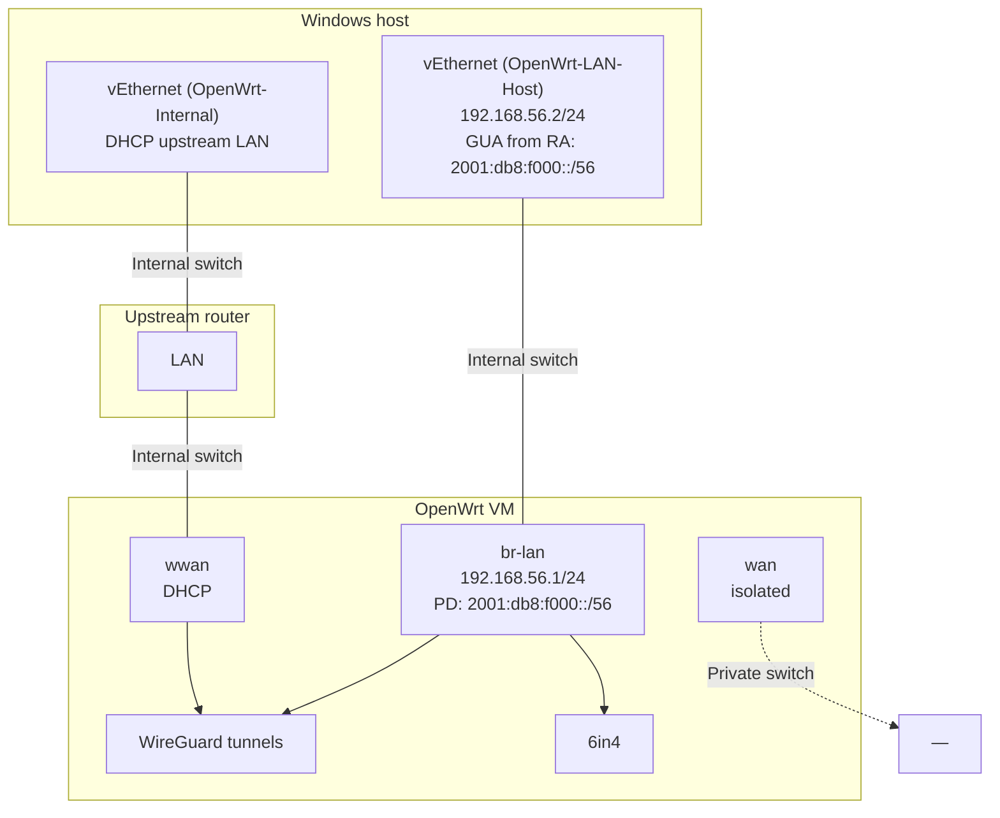

[Русский](OPENWRT_DEV_INFRASTRUCTURE.ru.md) | **English** | [Deutsch](OPENWRT_DEV_INFRASTRUCTURE.de.md)

# OpenWrt dev lab — mwan3 integration tests

> **Purpose:** description of a typical lab environment (Hyper-V + OpenWrt VM) for debugging **mwan3** and **mwan6-npt** before deployment to production.  
> **IPv6 in this document:** **fictitious** prefixes only (`2001:db8:…`, `fd00:db8:…`).

This document and the PowerShell scripts ship with the **mwan3** package:

| Artifact | Path after package install on OpenWrt |
|----------|---------------------------------------|
| This document (English) | `/usr/share/doc/mwan3/OPENWRT_DEV_INFRASTRUCTURE.en.md` |
| This document (Russian) | `/usr/share/doc/mwan3/OPENWRT_DEV_INFRASTRUCTURE.ru.md` |
| This document (German) | `/usr/share/doc/mwan3/OPENWRT_DEV_INFRASTRUCTURE.de.md` |
| Quick policy test | `/usr/share/doc/mwan3/integration/Test-Mwan3PolicySwitch.ps1` |
| Comprehensive channel test | `/usr/share/doc/mwan3/integration/Test-Mwan3ChannelSwitch.ps1` |

Copy the scripts to the **Windows host** (OpenWrt does not run them). Requires PowerShell 5.1+, SSH client, LAN access to the VM from the host.

---

## Participants

| Node | Role |
|------|------|
| **Windows host** | Hyper-V, SSH client, PowerShell tests from the LAN adapter |
| **OpenWrt VM** | OpenWrt with multi-WAN IPv6 (WireGuard / 6in4, mwan3, mwan6-npt) |
| **Upstream LAN** (optional) | Physical router or second segment for the VM WWAN NIC |

---

## Hyper-V: virtual switches

| Switch (example) | Type | vEthernet on Windows | Purpose |
|------------------|------|----------------------|---------|
| **OpenWrt-LAN-Host** | Internal | `vEthernet (OpenWrt-LAN-Host)` | VM **lan** — SSH, ping from host |
| **OpenWrt-Internal** | Internal | `vEthernet (OpenWrt-Internal)` | VM **wwan**, access to upstream LAN |
| **OpenWrt-WAN-Isolated** | Private | *(none on host)* | VM **wan** only |

Check adapters on the host:

```powershell
Get-NetAdapter | Where-Object InterfaceDescription -match 'Hyper-V' |
    Select-Object Name, InterfaceDescription, Status
```

---

## Interface diagram (example)



### VM NICs (example)

| OpenWrt iface | Switch | vEthernet Windows | IPv4 (example) | IPv6 (fictitious) |
|---------------|--------|-------------------|----------------|-------------------|
| **lan** / `br-lan` | OpenWrt-LAN-Host | `vEthernet (OpenWrt-LAN-Host)` | VM `.1/24`, host `.2` | PD `2001:db8:f000::/56`, RA |
| **wan** | OpenWrt-WAN-Isolated | — | — | — |
| **wwan** | OpenWrt-Internal | `vEthernet (OpenWrt-Internal)` | DHCP | via upstream |

---

## OpenWrt logical interfaces (IPv6 — fictitious)

| Interface | Type | `wan_prefix` (example) | NPT vs LAN `2001:db8:f000::/56` |
|-----------|-----|-------------------------|----------------------------------|
| **lan** | bridge | PD source | — |
| **tb62** | WireGuard | `2001:db8:62::/56` | **NPT** |
| **tb63** | WireGuard | `2001:db8:63::/56` | **NPT** |
| **tb64** | WireGuard | `2001:db8:f000::/56` | **identity** (no NPT) |
| **tb65** | WireGuard | `2001:db8:65::/56` | **NPT** |
| **tb66** | WireGuard | `2001:db8:66::/56` | **NPT** |
| **tb67** | WireGuard (ULA) | `fd00:db8:67::/64` | **NPT** |
| **henet** | 6in4 | `2001:db8:734a::/48` | **NPT** |

**mwan6-npt:** NPT is enabled when `LAN_PREFIX ≠ wan_prefix`; rebuilt on tunnel **ifup/ifdown** and on UCI/network (PD) changes.

---

## PowerShell: `Test-Mwan3PolicySwitch.ps1`

### Setup on Windows

```powershell
# Copy from router (example)
scp root@<dev-lan-ip>:/usr/share/doc/mwan3/integration/Test-Mwan3PolicySwitch.ps1 $env:USERPROFILE\mwan3-lab\
cd $env:USERPROFILE\mwan3-lab
```

### LAN source

The **`-LanInterface`** parameter is the Windows adapter name used by the host to reach the dev network.

The interface must have **exactly one** GUA (`Preferred`, not link-local / ULA / multicast). The script reads it via `Get-NetIPAddress`.

```powershell
Get-NetIPAddress -InterfaceAlias '<your-lan-adapter>' -AddressFamily IPv6 |
    Where-Object { $_.AddressState -eq 'Preferred' -and $_.IPAddress -notmatch '^(fe80:|ff|::|fd[0-9a-f]{2}:)' }
```

### What it does

1. SSH to OpenWrt (`-DevHost`, `-DevUser`)
2. Switches `mwan3.default_rule_v6.use_policy` (`-Policies`)
3. **Router:** `ping6` without `-I` (policy routing)
4. **Windows:** `ping -6 -S <GUA>` via `-LanInterface`
5. Optional `-HttpCheck`: egress IP → match to tunnel

### Examples

```powershell
.\Test-Mwan3PolicySwitch.ps1 `
    -DevHost 192.168.56.1 `
    -LanInterface 'vEthernet (OpenWrt-LAN-Host)'

.\Test-Mwan3PolicySwitch.ps1 `
    -DevHost 192.168.56.1 `
    -LanInterface 'vEthernet (OpenWrt-LAN-Host)' `
    -Policies ipv6_tb62,ipv6_tb66 `
    -HttpCheck
```

Configure `-DevHost`, `-LanInterface`, and `-Policies` for your lab network.

---

## PowerShell: `Test-Mwan3ChannelSwitch.ps1` (comprehensive)

Extended scenario for **verifying IPv6 channel switching** with traffic validation at multiple layers, including **tcpdump** on the tunnel interface.

### Difference from `Test-Mwan3PolicySwitch.ps1`

| | `Test-Mwan3PolicySwitch.ps1` | `Test-Mwan3ChannelSwitch.ps1` |
|---|---|---|
| `default_rule_v6` switching | yes | yes |
| Ping (router + Windows) | yes | yes |
| HTTP egress → tunnel map | optional (`-HttpCheck`) | **by default** (`-SkipHttpCheck` disables) |
| **tcpdump** on `tb*` | no | **yes** (`-SkipTcpDump` disables) |
| Prefix check for src in pcap | no | **yes** (registry: `wan_prefix`, SNAT, addr) |
| Leak to adjacent tb | no | optional (`-CheckLeakOnOtherTunnels`) |

### Dependencies on OpenWrt VM

```sh
apk add tcpdump    # required for pcap phase
# curl — for HTTP egress (usually already present)
```

### Setup on Windows

```powershell
scp root@<dev-lan-ip>:/usr/share/doc/mwan3/integration/Test-Mwan3ChannelSwitch.ps1 $env:USERPROFILE\mwan3-lab\
cd $env:USERPROFILE\mwan3-lab
Get-NetAdapter | Where-Object Status -eq 'Up'   # name for -LanInterface
```

### Testing methodology {#testing-methodology}

The test runs phases **sequentially** for **each** policy in `-Policies`. After all policies, the script restores `ipv6_primary`.

#### Phase 0 — preparation (once)

1. Load **tunnel registry** from the router via SSH:
   - addresses on `tb*` / `henet` (`REG_ADDR`);
   - SNAT from `mwan6-npt status` (`REG_SNAT`);
   - `mwan6-npt.<iface>.wan_prefix` (`REG_PREFIX`).
2. On Windows, determine **one** GUA on `-LanInterface` (`Get-NetIPAddress`, `Preferred`).

The registry is used to map: “visible egress IP / src in pcap → which tunnel”.

#### Phase 1 — policy switch

1. `uci set mwan3.default_rule_v6.use_policy=<policy>`
2. `/etc/init.d/mwan3 restart`
3. `mwan3 flush-conntrack`, `mwan3 sync-track-routes`
4. Pause `-WaitAfterSwitchSec` (default 5 s)
5. From `mwan3 status`, extract the **expected interface** (`MwanIface`, e.g. `tb62` for `ipv6_tb62`)

**Criterion:** `POLICY_ACTIVE` matches the requested policy.

#### Phase 2 — L3 reachability

| Check | How | Expectation |
|-------|-----|-------------|
| Router tracked | `ping6` without `-I` to `HostTracked` (`2606:4700:4700::1111`) | replies (mwan3 policy + `/128` track routes) |
| Router plain | `ping6` to `HostPlain` (`2001:470:20::2`) | replies via policy table |
| Windows LAN | `ping -6 -S <GUA>` from host | replies (forward + NPT SNAT on router) |

**Criterion:** all three — OK. On FAIL the script stops (or continues with `-ContinueOnFailure`).

#### Phase 3 — HTTP egress (unless `-SkipHttpCheck`)

1. Router: `curl -6` to `-HttpProbeUrls` (ipify, icanhazip, ident.me).
2. Response body = **visible egress IPv6**.
3. Address is mapped to tunnel (iface SNAT / `wan_prefix` / addr on iface).
4. Compare with **MwanIface** from phase 1.

**Criterion:** `HttpMatch` = `OK <ip> -> tbXX`.  
**Important:** for LAN clients, router egress is authoritative; Windows curl often shows LAN GUA, not SNAT.

#### Phase 4 — tcpdump and prefixes (unless `-SkipTcpDump`)

1. On the **expected** interface (`MwanIface`), run:

   ```text
   tcpdump -i tbXX -n -l -c <TcpDumpCount> ip6
   ```

2. Traffic is generated in parallel:
   - `ping6` from router (tracked + plain);
   - `curl -6` from router;
   - `ping6 -S <LAN GUA>` from router (simulates forward from LAN).

3. From `IP6 <src> > <dst>` lines, parse **outgoing src** → protocol `PCAP_SRC|iface|src|dst`.

4. Each `src` is checked via registry:

   ```text
   Resolve-TunnelForIp(src) == MwanIface
   ```

   That is, src must belong to the prefix/SNAT address of **this** tb channel, not a neighbor.

5. **Criterion:** `TcpDump` = `OK n=<count> src=[...]` and **no** `LEAK=`.

**Interpretation:**

| Result | Meaning |
|--------|---------|
| `OK n=5 src=[2001:db8:62::…]` | ≥1 packets on tbXX with src from channel prefix |
| `FAIL no-packets` | tcpdump caught nothing — tunnel down, wrong iface, or filter |
| `MISMATCH src=… map=tb63 want=tb62` | policy/NPT/routing diverge |
| `LEAK=tb63:…` | with `-CheckLeakOnOtherTunnels`, packets hit another tb |

#### Phase 5 (optional) — leak to adjacent tb

With `-CheckLeakOnOtherTunnels`, tcpdump briefly listens on **other** tb from registry (`-c 3`).  
Any `PCAP_LEAK` — FAIL: policy traffic “leaks” to another channel.

### Run examples

```powershell
# Full run (ping + HTTP + tcpdump)
.\Test-Mwan3ChannelSwitch.ps1 `
    -DevHost 192.168.56.1 `
    -LanInterface 'vEthernet (OpenWrt-LAN-Host)'

# Two policies + leak check
.\Test-Mwan3ChannelSwitch.ps1 `
    -Policies ipv6_tb62,ipv6_tb66 `
    -CheckLeakOnOtherTunnels

# Ping + tcpdump only (no HTTP)
.\Test-Mwan3ChannelSwitch.ps1 -SkipHttpCheck

# Debug single policy, do not stop on first error
.\Test-Mwan3ChannelSwitch.ps1 `
    -Policies ipv6_tb63 `
    -ContinueOnFailure `
    -TcpDumpCount 15
```

### Typical output

```text
Policy     : ipv6_tb62
MwanIface  : tb62
DevPing    : OK
WinPing    : OK
HttpMatch  : OK 2001:db8:62::… -> tb62
TcpDump    : OK n=8 src=[2001:db8:62::2, …]
Leak       : none
```

### Failure diagnostics

| Symptom | What to check on VM |
|---------|---------------------|
| `tcpdump-not-installed` | `apk add tcpdump` |
| `FAIL no-packets` | `mwan3 status`, `wg show`, `ip -6 route show table <id>` |
| `MISMATCH` in HttpMatch / TcpDump | `mwan6-npt status`, `uci show mwan6-npt.<iface>`, `mwan3 sync-track-routes` |
| `LEAK=` | split-default `::/1` on tb64 in main, policy vs NPT oif |
| WinPing OK, DevPing FAIL | track `/128` routes, `globals.track_host_routes` |

Manual check of one channel on router:

```sh
IFACE=tb62
tcpdump -i "$IFACE" -n -c 5 ip6 &
ping6 -c 2 2606:4700:4700::1111
wait
uci get mwan6-npt.tb62.wan_prefix
```

---

## Testing plan {#testing-plan}

The plan describes **when**, **with what**, and **with which criterion** to verify the lab before changes on production. Scripts automate phases; manual steps cover infrastructure the automation does not.

### Goals

| Goal | Success criterion |
|------|-------------------|
| Policy routing | `default_rule_v6` directs IPv6 to the correct `tb*` / `henet` |
| NPT / SNAT | Egress address and src in pcap belong to `wan_prefix` of the selected channel |
| LAN client | Windows with GUA on `-LanInterface` passes ping via forward + NPT |
| Channel isolation | No leak to adjacent tb with `-CheckLeakOnOtherTunnels` |
| Regression after changes | All policies from matrix — green before APK deploy to prod |

### mwan3 model: members → policies → rules

In the lab, all IPv6 traffic from LAN and router (for `dest ::/0`) goes through **one rule** `default_rule_v6`. Which physical channel is chosen is determined by the **policy** referenced by that rule.

```text
  UCI / LuCI                         runtime on router
  ─────────────                      ──────────────────

  config interface 'tb62'            mwan3track → online/offline
       ↓                                    ↓
  config member 'tb62_m2_w1'         metric 2, weight 1
       ↓                                    ↓
  config policy 'ipv6_tb62'    →     member tb62 only
       ↓                                    ↓
  config rule 'default_rule_v6'      nft: mark packet → ip -6 rule
       option use_policy              lookup table N (policy table)
       'ipv6_tb62'                           ↓
                                      egress dev tb62
                                            ↓
                                      mwan6-npt SNAT (if LAN ≠ wan_prefix)
```

| UCI entity | Role | Lab example |
|------------|------|-------------|
| **interface** | WAN channel + health-check (`track_ip`, ping) | `tb62`, `tb63`, `henet` |
| **member** | Bind interface → metric/weight inside policy | `tb62_m2_w1` → `tb62` |
| **policy** | Set of members (one or more) | `ipv6_tb62` — tb62 only |
| **rule** | Which dest/family/match → which policy | `default_rule_v6`: `::/0` → `use_policy` |

**Important for tests:** scripts change only **`mwan3.default_rule_v6.use_policy`**. They do **not** edit members, interfaces, or touch `ipv4_primary` / `default_rule_v4`.

---

### Lab IPv6 policies reference {#lab-ipv6-policies-reference}

Prefixes below are **fictitious** (`2001:db8:…`), structured like dev. On your VM, check names and `wan_prefix` in UCI.

#### `ipv6_primary` — default multi-WAN policy

**Purpose:** default for `default_rule_v6` after tests and in normal lab operation. Not bound to one tb — mwan3 **dynamically** picks uplink among members that are **online** per health-check.

**Composition (typical dev, UCI):**

```uci
config member 'tb62_m2_w1'
	option interface 'tb62'
	option metric '2'
	option weight '1'

config member 'tb63_m3_w1'
	option interface 'tb63'
	option metric '3'
	…

config policy 'ipv6_primary'
	list use_member 'tb62_m2_w1'
	list use_member 'tb63_m3_w1'
	list use_member 'tb6_m4_w1'
	list use_member 'tb65_m5_w1'
	list use_member 'tb66_m6_w1'
```

| Parameter | Value | Meaning |
|-----------|-------|---------|
| Members | tb62…tb66 (all active WG on lab) | candidate pool |
| **metric** member | 2, 3, 4, 5, 6 | **lower = higher priority** among online |
| **weight** | 1 (in lab) | with **equal** metric — traffic share (load balance); with different metrics — unused |
| Channel selection | mwan3track online/offline | offline member **excluded** from policy table |

**How channel is chosen (failover without UCI change):**

```text
1. mwan3track pings track_ip of each interface
2. interface offline → its member not in policy routing table
3. among remaining online — member with lowest metric wins
4. when primary (lower metric) recovers, traffic returns to it
```

**Example:** online tb62 (m=2), tb63 (m=3), tb66 (m=6) → egress via **tb62**.  
tb62 offline → automatically **tb63**. tb62 online again → **tb62** again.

**`mwan3 status` for ipv6_primary** shows **one** iface — current winner, e.g.:

```text
ipv6_primary:
 tb62
```

**NPT:** active SNAT follows **actual** egress (mwan6-npt must have rule for `oif` of selected tb). On failover egress prefix **changes** — normal for multi-WAN.

**Testing ipv6_primary (L3, not L1/L2 matrix):**

| # | Action | Expectation |
|---|--------|-------------|
| P.1 | `use_policy=ipv6_primary`, all tb online | `mwan3 status` → tb with **lowest** metric (usually tb62) |
| P.2 | `ifdown tb62` (or track offline) | status → next online (tb63) |
| P.3 | ping6 / curl from LAN | egress prefix of **new** channel |
| P.4 | `ifup tb62` | return to tb62 after recovery_interval |
| P.5 | after tests | PS scripts already set ipv6_primary |

Scripts **Test-Mwan3PolicySwitch** / **ChannelSwitch** do **not** run ipv6_primary — only restore at end. ipv6_primary failover is a **manual** L3 scenario.

**IPv4 analog:** `ipv4_primary` — members `wwan_m1_w1` + `wan_m2_w1` (WiFi + isolated wan), same metric/failover principle for `default_rule_v4`.

#### Failover vs load balancing — the difference

One policy can have **multiple members**. Mode is determined by **metric** and **weight**:

| Mode | member metrics | weight | Behavior | Policy example |
|------|----------------|--------|----------|----------------|
| **Failover** | **different** (2, 3, …) | irrelevant (usually 1) | **one** channel active at a time — lowest metric among **online**; backup only if primary offline | `ipv6_tb62_tb63` |
| **Load balancing** | **equal** | **different** (3:1, …) | both online → traffic **split** by weight | `ipv6_balance_tb62_tb63` |
| **Primary pool** | different | 1 | like failover, but >2 members | `ipv6_primary` |

```text
Failover (m=2, m=3):                Load balance (m=2 w=3, m=2 w=1):
  tb62 online → 100% tb62               tb62 online + tb63 online → ~75% / ~25%
  tb62 offline → 100% tb63              one offline → 100% on survivor
```

**PowerShell tests for dual policies:** scripts verify **primary channel only** (primary — min metric, equal metric → first in `use_member` list). Ping/curl/tcpdump on router go via `mwan3 use <primary>`. Failover to backup and balance shares — **L3 manual**, not automatic L1/L2.

---

#### Dual-channel policies (lab)

##### `ipv6_tb62_tb63` — **failover**

| Role | Member | Interface | metric | weight |
|------|--------|-----------|--------|--------|
| **Primary** | `tb62_m2_w1` | tb62 | **2** | 1 |
| **Backup** | `tb63_m3_w1` | tb63 | **3** | 1 |

```uci
config policy 'ipv6_tb62_tb63'
	list use_member 'tb62_m2_w1'
	list use_member 'tb63_m3_w1'
	option last_resort 'unreachable'
```

**Behavior:** tb62 online → all traffic tb62; tb62 offline → tb63; both offline → unreachable.

**L1/L2 (script):** **tb62** only (`mwan3 use tb62`). **L3:** `ifdown tb62` → manual check tb63.

##### `ipv6_balance_tb62_tb63` — **load balancing**

| Role | Member | Interface | metric | weight | Share |
|------|--------|-----------|--------|--------|-------|
| **Primary for test** | `tb62_bal_w3` | tb62 | **2** | **3** | ~75% |
| Second | `tb63_bal_w1` | tb63 | **2** | **1** | ~25% |

```uci
config member 'tb62_bal_w3'
	option interface 'tb62'
	option metric '2'
	option weight '3'

config member 'tb63_bal_w1'
	option interface 'tb63'
	option metric '2'
	option weight '1'

config policy 'ipv6_balance_tb62_tb63'
	list use_member 'tb62_bal_w3'
	list use_member 'tb63_bal_w1'
```

**Behavior:** both online → mwan3 distributes new flows by weight 3:1; one offline → 100% on survivor.

**L1/L2 (script):** **tb62 only** checked (first in `use_member`), not 75/25 share. **L3:** repeated `curl -6` / conntrack counters — ~3:1 shares.

**Install on VM:**

```sh
# from Windows: scp + ssh, or from git on WSL
scp project/mwan3/scripts/install-lab-dual-policies.sh root@192.168.56.1:/tmp/
ssh root@192.168.56.1 sh /tmp/install-lab-dual-policies.sh
```

##### Summary: single vs dual vs primary

| Policy | Mode | Members | L1/L2 script checks |
|--------|------|---------|---------------------|
| `ipv6_tb62` | single channel | 1 | tb62 |
| `ipv6_tb62_tb63` | **failover** | 2 (m≠) | **tb62 only** |
| `ipv6_balance_tb62_tb63` | **load balance** | 2 (m=, w≠) | **tb62 only** |
| `ipv6_primary` | failover pool | 5+ | not in PS run |

*(Optional: `ipv6_tb62_henet` — WG+6in4 failover, see older notes in IPV6_TUNNELBROKER_SWITCH.md.)*

---

#### Single-channel policies (for L1/L2)

Each policy **strictly** fixes egress on one interface — used to verify channel isolation and NPT/SNAT matches `wan_prefix`.

| Policy | Member | Interface | `wan_prefix` (example) | NPT vs LAN `2001:db8:f000::/56` | What we verify |
|--------|--------|-----------|-------------------------|----------------------------------|----------------|
| **`ipv6_tb62`** | `tb62_m2_w1` | `tb62` | `2001:db8:62::/56` | NPT | egress/SNAT from tb62 `/56` |
| **`ipv6_tb63`** | `tb63_m3_w1` | `tb63` | `2001:db8:63::/56` | NPT | different prefix — distinguish from tb62 |
| **`ipv6_tb6`** | `tb6_m4_w1` | `tb6` | `2001:db8:6::/56` | NPT | base WG channel |
| **`ipv6_tb65`** | `tb65_m5_w1` | `tb65` | `2001:db8:65::/64` | NPT | /64 wan_prefix (not /56) |
| **`ipv6_tb66`** | `tb66_m6_w1` | `tb66` | `2001:db8:66::/56` | NPT | circuit with separate PD |
| **`ipv6_tb67`** | `tb67_m7_w1` | `tb67` | `fd00:db8:67::/64` | NPT (ULA) | ULA egress via ipv64 |
| **`ipv6_henet`** | `henet_m7_w1` | `henet` | `2001:db8:734a::/48` | NPT | 6in4 HE, not WireGuard |

Policy **`ipv6_tb64`** is usually **absent** on dev (tb64 often LAN PD / identity NPT). On prod tb64 may be the sole IPv6 uplink — different profile, not lab matrix.

Check actual list on VM:

```sh
uci show mwan3 | grep "=policy"
for p in $(uci show mwan3 | sed -n "s/^mwan3\.\([^.]*\)=policy/\1/p"); do
  echo "=== $p ==="
  uci show mwan3.$p
  iface=$(mwan3 status 2>/dev/null | sed -n "s/^ *${p}: *//p" | head -1)
  echo "mwan3 status -> ${iface:-?}"
done
```

---

### How policy switching works

Test scripts run the **same sequence** on the router (see `Switch-DevPolicy`):

| Step | Action | Why |
|------|--------|-----|
| 1 | `uci set mwan3.default_rule_v6.use_policy=<policy>` | active policy for all `::/0` |
| 2 | `uci commit mwan3` | persist |
| 3 | `/etc/init.d/mwan3 restart` | rebuild nft rules, ip rules, policy tables |
| 4 | `mwan3 flush-conntrack` | drop old sessions → new mark |
| 5 | `mwan3 sync-track-routes` | restore `/128` to `track_ip` (IPv6 only) |
| 6 | pause 5 s | wait for mwan3track + hotplug mwan6-npt |

**What changes in kernel (simplified):**

```text
LAN client ping6 / router curl -6
        │
        ▼
  nft mangle: mark 0xN00  (policy table id)
        │
        ▼
  ip -6 rule: from … fwmark 0xN00 lookup table N
        │
        ▼
  ip -6 route table N: default dev tbXX
        │
        ▼
  mwan6-npt: SNAT src LAN GUA → address from wan_prefix tbXX
        │
        ▼
  tcpdump -i tbXX: src ∈ wan_prefix of channel
```

**What does NOT change on switch:**

- split-default `::/1` / `8000::/1` in **main** (metric tb*) — remains; policy routing for **forward** LAN goes by **mark**, not main;
- `network.*`, WireGuard keys, `mwan6-npt.*.wan_prefix` — only if you edited UCI separately;
- IPv4 routes / `default_rule_v4`.

**Typical failures after switch:**

| Symptom | Likely cause |
|---------|--------------|
| Ping OK from router, FAIL from Windows | NPT did not switch to `oif tbXX`; stale conntrack |
| `MwanIface` correct, egress wrong prefix | mwan6-npt globals / multiple SNAT rules |
| DevPing FAIL, WinPing OK | track `/128` missing → `mwan3 sync-track-routes` |
| `route get` shows tb64, policy tb62 | check **mark path**, not main table |

Manual switch (without script):

```sh
POLICY=ipv6_tb62
uci set mwan3.default_rule_v6.use_policy="$POLICY"
uci commit mwan3
/etc/init.d/mwan3 restart
mwan3 flush-conntrack
mwan3 sync-track-routes
mwan3 status | sed -n "/Current ipv6 policies:/,/Directly connected/p"
```

Restore after manual experiments:

```sh
uci set mwan3.default_rule_v6.use_policy=ipv6_primary
uci commit mwan3
/etc/init.d/mwan3 restart
```

---

### Policy switch testing details

#### What each level verifies

| Level | Policy switch | Reachability | Egress = channel | L2 pcap |
|-------|:-------------:|:------------:|:----------------:|:-------:|
| L0 | — | partial | — | — |
| L1 | ✓ each in `-Policies` | ping router + Windows | HTTP `DevMatch` | — |
| L2 | ✓ | ping router + Windows | HTTP + **tcpdump src** | ✓ |
| L3 | manual + after reboot | commands from L3 table | `mwan6-npt status` | optional |

#### Policy order in one run

Recommended **simple to complex**:

```text
1. ipv6_tb62          — baseline, single channel
2. ipv6_tb63          — different broker/prefix
3. ipv6_tb66          — separate circuit
4. ipv6_tb62_tb63       — failover (L2 → tb62 only; L3 failover)
5. ipv6_balance_tb62_tb63 — load balance (L2 → tb62 only; L3 3:1 shares)
6. ipv6_henet           — single 6in4 channel (if up)
7. ipv6_primary         — normal mode / L3 failover by metric
```

Not required to run all at once: for one tunnel fix, `-Policies ipv6_tb63` is enough.

#### Ping hosts (why two)

| Host | Address (default) | Role |
|------|-------------------|------|
| **Tracked** | `2606:4700:4700::1111` | in `track_ip` of all tb; has `/128` in policy table → tests **track_host_routes** |
| **Plain** | `2001:470:20::2` | HE anycast, **no** host-route on Windows → tests **normal** policy path |

Both targets must reply with active policy. FAIL on Tracked only → check `sync-track-routes` and `/128` in interface table id.

#### HTTP egress (L1 `-HttpCheck`, L2 by default)

| Source | Method | Authoritative? |
|--------|--------|----------------|
| Router | `curl -6` to ipify / icanhazip / ident.me | **yes** — SNAT after mwan6-npt visible |
| Windows | `curl -6 --interface <LAN GUA>` | **no** for match — often LAN GUA, not tunnel prefix |

**`DevMatch` / `HttpMatch` criterion:** response body from router → IP → `Resolve-TunnelForIp` → must match `MwanIface` from `mwan3 status`.

#### tcpdump (L2 only)

For policy `ipv6_tbXX` expect:

1. Capture **only** on interface `tbXX` (not on `br-lan`).
2. Each `IP6 <src> > …`: `src` ∈ `wan_prefix` tbXX **or** SNAT address from registry.
3. With `-CheckLeakOnOtherTunnels`: on `tbYY` (YY ≠ XX) **no** `PCAP_LEAK`.

Example expectation for `ipv6_tb62` (fictitious addresses):

```text
Policy:     ipv6_tb62
MwanIface:  tb62
HttpMatch:  OK 2001:db8:62::… -> tb62
TcpDump:    OK n=6 src=[2001:db8:62::2, 2001:db8:62::…]
```

#### Script parameters by scenario

| Scenario | PolicySwitch | ChannelSwitch |
|----------|--------------|---------------|
| Quick sanity | `-HttpCheck` | — |
| Before prod | `-HttpCheck`, all policies | `-CheckLeakOnOtherTunnels` |
| Debug NPT on one tb | `-Policies ipv6_tb63` | `-Policies ipv6_tb63 -TcpDumpCount 20` |
| Routing only | without `-HttpCheck` | `-SkipHttpCheck` |
| No pcap (no tcpdump) | — | `-SkipTcpDump` |

---

### Levels (L0 → L3)

```text
L0  Smoke lab          — VM, SSH, mwan3 online, one ping
L1  Policy switch      — Test-Mwan3PolicySwitch.ps1 (ping ± HTTP)
L2  Channel compliance — Test-Mwan3ChannelSwitch.ps1 (ping + HTTP + tcpdump)
L3  Manual audit       — LuCI, conntrack, repeat after reboot (optional)
```

**Rule:** do not skip a level. FAIL on L1 → do not run L2 until fixed.

---

### L0 — Smoke (before any test)

**When:** after VM start, package updates, UCI network/mwan3 changes.

| # | Action | Command / check | OK if |
|---|--------|-----------------|-------|
| 0.1 | VM reachable | `ssh root@<dev-lan-ip> uptime` | SSH without errors |
| 0.2 | mwan3 online | `mwan3 status \| head -20` | wwan/tb* not offline (except intentionally disabled) |
| 0.3 | mwan6-npt | `/etc/init.d/mwan6-npt status` | SNAT rules for active tb |
| 0.4 | LAN GUA on Windows | `Get-NetIPAddress` on `-LanInterface` | exactly one Preferred GUA |
| 0.5 | Basic IPv6 | `ping -6 -S <GUA> 2001:4860:4860::8888` from host | replies |
| 0.6 | L2 dependencies | `command -v tcpdump curl` on VM | both found (for L2) |

**Time:** ~5 min.

---

### L1 — Policy switching (quick)

**Tool:** `Test-Mwan3PolicySwitch.ps1`

**When:**

- after mwan3 / UCI policy changes;
- after sysupgrade or `apk upgrade mwan3`;
- daily sanity before extended L2.

**Policy matrix (minimum):**

Meaning of each row — see [policies reference](#lab-ipv6-policies-reference). “Required” column — what to include in `-Policies` before prod.

| Policy | Member → iface | Expected `MwanIface` | Required | Test notes |
|--------|----------------|----------------------|----------|------------|
| `ipv6_tb62` | tb62_m2_w1 → tb62 | `tb62` | yes | NPT /56 baseline |
| `ipv6_tb63` | tb63_m3_w1 → tb63 | `tb63` | yes | different broker/prefix |
| `ipv6_tb66` | tb66_m6_w1 → tb66 | `tb66` | yes | circuit, separate PD |
| `ipv6_tb65` | tb65_m5_w1 → tb65 | `tb65` | if present | wan_prefix /64 |
| `ipv6_tb6` | tb6_m4_w1 → tb6 | `tb6` | optional | base WG |
| `ipv6_tb67` | tb67_m7_w1 → tb67 | `tb67` | if on dev | ULA egress |
| `ipv6_henet` | henet_* → henet | `henet` | if 6in4 up | not WG, `::/0` via SIT |
| **`ipv6_tb62_tb63`** | tb62 (m2) + tb63 (m3) | **tb62** (primary only) | optional | **failover**; L3 failover |
| **`ipv6_balance_tb62_tb63`** | tb62_bal (w3) + tb63_bal (w1) | **tb62** (primary only) | optional | **load balance** 75/25; L3 shares |

**Per policy the script:**

1. sets `use_policy` → waits restart + flush + sync-track-routes;
2. reads `mwan3 status` → compares `ipv6_tbXX:` line with expected iface;
3. ping tracked + plain from router and Windows (`-S` LAN GUA);
4. with `-HttpCheck`: curl from router → `DevMatch`.

**FAIL on one policy does not cancel remaining run** only with `-ContinueOnFailure` (ChannelSwitch); PolicySwitch **stops** on first error by default.

**Recommended run:**

```powershell
.\Test-Mwan3PolicySwitch.ps1 `
    -DevHost <dev-lan-ip> `
    -LanInterface '<your-lan-adapter>' `
    -HttpCheck
```

**PASS criteria (per policy):**

| Check | PASS | Link to policy |
|-------|------|----------------|
| `POLICY_ACTIVE` | = requested (`ipv6_tb62`, …) | UCI `default_rule_v6` applied |
| `MwanIface` | = iface from reference | policy → member → interface |
| `DevTracked` / `DevPlain` | OK | policy table + track `/128` |
| `WinTracked` / `WinPlain` | OK | forward + NPT for LAN GUA |
| `DevMatch` (with `-HttpCheck`) | `OK <ip> -> <MwanIface>` | SNAT egress ∈ channel `wan_prefix` |

**Time:** ~3–5 min per policy (4 policies ≈ 15–20 min).

---

### L2 — Channel compliance (comprehensive)

**Tool:** `Test-Mwan3ChannelSwitch.ps1`

**When:**

- before building/installing mwan3 on **prod**;
- after **mwan6-npt** changes (SNAT, sync with policy);
- after `track_host_routes`, hotplug, `flush-conntrack` edits;
- regression after “traffic on wrong tb” incident.

**Preparation (once per session):**

```sh
apk add tcpdump    # if not yet installed
```

**Run (full):**

```powershell
.\Test-Mwan3ChannelSwitch.ps1 `
    -DevHost <dev-lan-ip> `
    -LanInterface '<your-lan-adapter>' `
    -CheckLeakOnOtherTunnels
```

**PASS criteria (per policy):**

| Check | PASS | Link to policy |
|-------|------|----------------|
| `DevPing` | OK | same as L1 DevTracked+DevPlain |
| `WinPing` | OK | LAN via selected policy |
| `HttpMatch` | `OK … -> MwanIface` | egress IP belongs to policy channel |
| `TcpDump` | `OK n=…` all src ∈ wan_prefix | physical egress dev = policy iface |
| `Leak` | `none` | adjacent tb do not get this policy traffic |

**Short run (debug one policy):**

```powershell
.\Test-Mwan3ChannelSwitch.ps1 `
    -Policies ipv6_tb62 `
    -ContinueOnFailure `
    -TcpDumpCount 15
```

**Time:** ~5–8 min per policy with tcpdump (4 policies ≈ 25–35 min).

Phase 0–5 details — in [methodology](#testing-methodology) section above.

---

### L3 — Manual audit (optional)

**When:** before major release; after L2 FAIL with unclear cause; after VM reboot.

| # | Check | Command |
|---|-------|---------|
| 3.1 | Policy after reboot | `uci get mwan3.default_rule_v6.use_policy` → `ipv6_primary` |
| 3.2 | Track routes | `mwan3 sync-track-routes`; `ip -6 route show table 3 \| grep /128` |
| 3.3 | No IPv4 host routes | `ip route show table 1 \| grep 1.1.1.1` → empty |
| 3.4 | LuCI MultiWAN | all tested ifaces online |
| 3.5 | Conntrack after switch | `mwan3 flush-conntrack` does not break active policy |
| 3.6 | **ipv6_primary** failover | `ifdown` tb with min metric → `mwan3 status` → next online |
| 3.7 | **ipv6_tb62_tb63** backup | offline tb62 → status tb63 (L3, not PS) |
| 3.8 | **ipv6_balance_tb62_tb63** | L3: series of curl → ~3:1 tb62/tb63 counters |

**Time:** ~15 min.

---

### Scenarios “when to run what”

| Event | L0 | L1 | L2 | L3 |
|-------|:--:|:--:|:--:|:--:|
| Lab start / VM boot | ✓ | | | |
| UCI mwan3 edit | ✓ | ✓ | | |
| mwan6-npt / NPT edit | ✓ | ✓ | ✓ | |
| New mwan3 APK build | ✓ | ✓ | ✓ | |
| APK install on prod (after dev) | | | ✓ | ✓ |
| “Wrong channel” incident | ✓ | | ✓ | ✓ |

---

### Pre-prod deployment checklist

```text
[ ] L0 smoke — green
[ ] L1 all matrix policies — DevMatch OK (-HttpCheck)
[ ] L2 all policies — HttpMatch + TcpDump OK, Leak none
[ ] UCI mwan3 exported to git backup (Backup/openwrt-prod)
[ ] Bundle versions = git: `./scripts/test-bundle-versions.sh` (all OK on dev)
[ ] Same WG keys not active on prod and dev simultaneously (if shared)
[ ] After tests script restored ipv6_primary (or verified manually)
```

---

### Run log (template)

| Date | mwan3 | mwan6-npt | L1 | L2 | Policies | Notes |
|------|-------|-----------|:--:|:--:|----------|-------|
| 2026-06-06 | 2.12.1-r6 | 1.0.6-2 | — | — | tb62–tb67 | detect-wan-prefix PD+ULA |
| YYYY-MM-DD | 2.12.1-r6 | 1.0.6-2 | PASS | PASS | tb62,tb63,tb66 | before prod |

---

## Typical workflow

Brief sequence; full plan — in [Testing plan](#testing-plan) section.

```text
1. Bring up OpenWrt VM → L0 smoke
2. Install mwan3, mwan6-npt; apk add tcpdump
3. Copy PS scripts to Windows host
4. L1: Test-Mwan3PolicySwitch.ps1 -HttpCheck
5. L2: Test-Mwan3ChannelSwitch.ps1 -CheckLeakOnOtherTunnels
6. On L2 PASS — build/install on prod; L3 as needed
7. Shared WG keys: do not bring up same tunnels on dev and prod simultaneously
```

---

## Lab dependencies

| Component | Purpose |
|-----------|---------|
| **mwan3** (this package) | Policy routing, track routes |
| **tcpdump** (on VM) | Pcap phase in `Test-Mwan3ChannelSwitch.ps1` |
| **mwan6-npt** | NPTv6 multi-WAN (separate IPK, see `Backup/openwrt-prod/package/mwan6-npt`) |
| **mwan6-npt-luci** | LuCI overlay (`install-luci-openwrt-dev.sh`), apk `luci-app-mwan6-npt` |

**Current versions (git):** mwan3 `2.12.1-r6`, mwan6-npt `1.0.6-2`, luci-app-mwan3 `1.0.1-r1`, luci-app-mwan6-npt `1.2.2-r1`, luci-i18n-mwan6-npt-ru `1.0.2-r1` (see `scripts/bundle-versions.expected`).

**Compare dev/prod:**

```bash
cd project/mwan3
./scripts/test-bundle-versions.sh
```

---

## Limitations

- This document describes a **typical** lab topology; IP, VM names, and adapter names are configured locally.
- End-to-end fw4 tests without mwan3 — out of scope for this script.
- Production configuration and live tunnels are not documented here.
