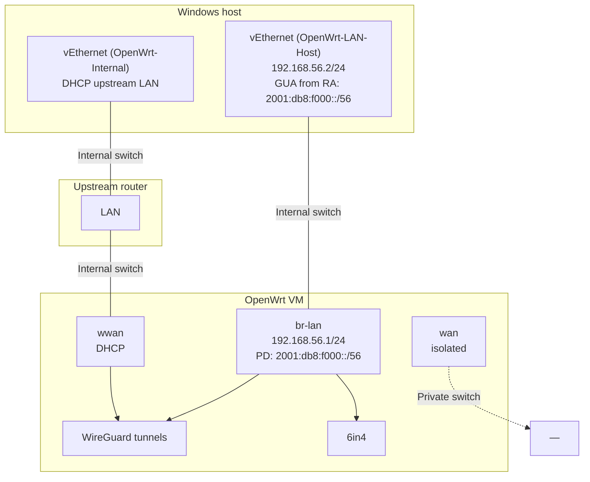

# OpenWrt dev lab — интеграционные тесты mwan3

> **Назначение:** описание типовой лабораторной среды (Hyper-V + OpenWrt VM) для отладки **mwan3** и **mwan6-npt** до выкладки на production.  
> **IPv6 в документе:** только **вымышленные** префиксы (`2001:db8:…`, `fd00:db8:…`).

Документ и PowerShell-скрипт поставляются с пакетом **mwan3**:

| Артефакт | Путь после установки пакета на OpenWrt |
|----------|----------------------------------------|
| Этот файл | `/usr/share/doc/mwan3/OPENWRT_DEV_INFRASTRUCTURE.md` |
| Быстрый тест политик | `/usr/share/doc/mwan3/integration/Test-Mwan3PolicySwitch.ps1` |
| Комплексный тест каналов | `/usr/share/doc/mwan3/integration/Test-Mwan3ChannelSwitch.ps1` |

Скопируйте скрипт на **Windows-хост** (OpenWrt его не исполняет). Требуется PowerShell 5.1+, SSH-клиент, доступ к LAN VM с хоста.

---

## Участники

| Узел | Роль |
|------|------|
| **Windows host** | Hyper-V, SSH-клиент, PowerShell-тесты с LAN-адаптера |
| **OpenWrt VM** | OpenWrt с multi-WAN IPv6 (WireGuard / 6in4, mwan3, mwan6-npt) |
| **Upstream LAN** (опционально) | Физический роутер или второй сегмент для WWAN NIC VM |

---

## Hyper-V: виртуальные коммутаторы

| Switch (пример) | Тип | vEthernet на Windows | Назначение |
|-----------------|-----|----------------------|------------|
| **OpenWrt-LAN-Host** | Internal | `vEthernet (OpenWrt-LAN-Host)` | VM **lan** — SSH, ping с хоста |
| **OpenWrt-Internal** | Internal | `vEthernet (OpenWrt-Internal)` | VM **wwan**, доступ к upstream LAN |
| **OpenWrt-WAN-Isolated** | Private | *(на хосте нет)* | только VM **wan** |

Проверка адаптеров на хосте:

```powershell
Get-NetAdapter | Where-Object InterfaceDescription -match 'Hyper-V' |
    Select-Object Name, InterfaceDescription, Status
```

---

## Схема интерфейсов (пример)



### NIC VM (пример)

| OpenWrt iface | Switch | vEthernet Windows | IPv4 (пример) | IPv6 (вымышленно) |
|---------------|--------|-------------------|---------------|-------------------|
| **lan** / `br-lan` | OpenWrt-LAN-Host | `vEthernet (OpenWrt-LAN-Host)` | VM `.1/24`, host `.2` | PD `2001:db8:f000::/56`, RA |
| **wan** | OpenWrt-WAN-Isolated | — | — | — |
| **wwan** | OpenWrt-Internal | `vEthernet (OpenWrt-Internal)` | DHCP | через upstream |

---

## Логические интерфейсы OpenWrt (IPv6 — вымышленные)

| Интерфейс | Тип | `wan_prefix` (пример) | NPT vs LAN `2001:db8:f000::/56` |
|-----------|-----|-------------------------|----------------------------------|
| **lan** | bridge | PD источник | — |
| **tb62** | WireGuard | `2001:db8:62::/56` | **NPT** |
| **tb63** | WireGuard | `2001:db8:63::/56` | **NPT** |
| **tb64** | WireGuard | `2001:db8:f000::/56` | **identity** (без NPT) |
| **tb65** | WireGuard | `2001:db8:65::/56` | **NPT** |
| **tb66** | WireGuard | `2001:db8:66::/56` | **NPT** |
| **tb67** | WireGuard (ULA) | `fd00:db8:67::/64` | **NPT** |
| **henet** | 6in4 | `2001:db8:734a::/48` | **NPT** |

**mwan6-npt:** NPT включается, если `LAN_PREFIX ≠ wan_prefix`; пересборка при **ifup/ifdown** туннеля и изменении UCI/network (PD).

---

## PowerShell: `Test-Mwan3PolicySwitch.ps1`

### Подготовка на Windows

```powershell
# Скопировать с роутера (пример)
scp root@<dev-lan-ip>:/usr/share/doc/mwan3/integration/Test-Mwan3PolicySwitch.ps1 $env:USERPROFILE\mwan3-lab\
cd $env:USERPROFILE\mwan3-lab
```

### LAN source

Параметр **`-LanInterface`** — имя адаптера Windows, через который хост ходит в dev-сеть.

На интерфейсе ожидается **ровно один** GUA (`Preferred`, не link-local / ULA / multicast). Скрипт читает его через `Get-NetIPAddress`.

```powershell
Get-NetIPAddress -InterfaceAlias '<your-lan-adapter>' -AddressFamily IPv6 |
    Where-Object { $_.AddressState -eq 'Preferred' -and $_.IPAddress -notmatch '^(fe80:|ff|::|fd[0-9a-f]{2}:)' }
```

### Что делает

1. SSH на OpenWrt (`-DevHost`, `-DevUser`)
2. Переключает `mwan3.default_rule_v6.use_policy` (`-Policies`)
3. **Router:** `ping6` без `-I` (policy routing)
4. **Windows:** `ping -6 -S <GUA>` через `-LanInterface`
5. Опционально `-HttpCheck`: egress IP → сопоставление с туннелем

### Примеры

```powershell
.\Test-Mwan3PolicySwitch.ps1 `
    -DevHost 192.168.56.1 `
    -LanInterface 'vEthernet (OpenWrt-LAN-Host)'

.\Test-Mwan3PolicySwitch.ps1 `
    -DevHost 192.168.56.1 `
    -LanInterface 'vEthernet (OpenWrt-LAN-Host)' `
    -Policies ipv6_tb62,ipv6_tb66 `
    -HttpCheck
```

Параметры `-DevHost`, `-LanInterface`, `-Policies` настраиваются под вашу lab-сеть.

---

## PowerShell: `Test-Mwan3ChannelSwitch.ps1` (комплексный)

Расширенный сценарий для **проверки переключения IPv6-каналов** с верификацией трафика на нескольких уровнях, включая **tcpdump** на интерфейсе туннеля.

### Отличие от `Test-Mwan3PolicySwitch.ps1`

| | `Test-Mwan3PolicySwitch.ps1` | `Test-Mwan3ChannelSwitch.ps1` |
|---|---|---|
| Переключение `default_rule_v6` | да | да |
| Ping (router + Windows) | да | да |
| HTTP egress → tunnel map | опционально (`-HttpCheck`) | **по умолчанию** (`-SkipHttpCheck` отключает) |
| **tcpdump** на `tb*` | нет | **да** (`-SkipTcpDump` отключает) |
| Проверка префикса src в pcap | нет | **да** (registry: `wan_prefix`, SNAT, addr) |
| Утечка на соседние tb | нет | опционально (`-CheckLeakOnOtherTunnels`) |

### Зависимости на OpenWrt VM

```sh
apk add tcpdump    # обязательно для pcap-фазы
# curl — для HTTP egress (обычно уже есть)
```

### Подготовка на Windows

```powershell
scp root@<dev-lan-ip>:/usr/share/doc/mwan3/integration/Test-Mwan3ChannelSwitch.ps1 $env:USERPROFILE\mwan3-lab\
cd $env:USERPROFILE\mwan3-lab
Get-NetAdapter | Where-Object Status -eq 'Up'   # имя для -LanInterface
```

### Методика тестирования {#методика-тестирования}

Тест для **каждой** политики из `-Policies` выполняет фазы **последовательно**. После всех политик скрипт восстанавливает `ipv6_primary`.

#### Фаза 0 — подготовка (один раз)

1. Загрузить **tunnel registry** с роутера по SSH:
   - адреса на `tb*` / `henet` (`REG_ADDR`);
   - SNAT из `mwan6-npt status` (`REG_SNAT`);
   - `mwan6-npt.<iface>.wan_prefix` (`REG_PREFIX`).
2. На Windows определить **один** GUA на `-LanInterface` (`Get-NetIPAddress`, `Preferred`).

Registry используется для сопоставления: «видимый egress IP / src в pcap → какой туннель».

#### Фаза 1 — переключение политики

1. `uci set mwan3.default_rule_v6.use_policy=<policy>`
2. `/etc/init.d/mwan3 restart`
3. `mwan3 flush-conntrack`, `mwan3 sync-track-routes`
4. Пауза `-WaitAfterSwitchSec` (по умолчанию 5 с)
5. Из `mwan3 status` извлекается **ожидаемый интерфейс** (`MwanIface`, например `tb62` для `ipv6_tb62`)

**Критерий:** `POLICY_ACTIVE` совпадает с запрошенной политикой.

#### Фаза 2 — L3 reachability

| Проверка | Как | Ожидание |
|----------|-----|----------|
| Router tracked | `ping6` без `-I` к `HostTracked` (`2606:4700:4700::1111`) | ответы (mwan3 policy + `/128` track routes) |
| Router plain | `ping6` к `HostPlain` (`2001:470:20::2`) | ответы через policy table |
| Windows LAN | `ping -6 -S <GUA>` с хоста | ответы (forward + NPT SNAT на роутере) |

**Критерий:** все три — OK. При FAIL скрипт останавливается (или продолжает с `-ContinueOnFailure`).

#### Фаза 3 — HTTP egress (если не `-SkipHttpCheck`)

1. Router: `curl -6` к `-HttpProbeUrls` (ipify, icanhazip, ident.me).
2. Тело ответа = **видимый egress IPv6**.
3. Адрес сопоставляется с туннелем (iface SNAT / `wan_prefix` / addr on iface).
4. Сравнение с **MwanIface** из фазы 1.

**Критерий:** `HttpMatch` = `OK <ip> -> tbXX`.  
**Важно:** для LAN-клиента authoritative — router egress; Windows curl часто показывает LAN GUA, не SNAT.

#### Фаза 4 — tcpdump и префиксы (если не `-SkipTcpDump`)

1. На **ожидаемом** интерфейсе (`MwanIface`) запускается:

   ```text
   tcpdump -i tbXX -n -l -c <TcpDumpCount> ip6
   ```

2. Параллельно генерируется трафик:
   - `ping6` с роутера (tracked + plain);
   - `curl -6` с роутера;
   - `ping6 -S <LAN GUA>` с роутера (имитация forward с LAN).

3. Из строк `IP6 <src> > <dst>` парсятся **исходящие src** → протокол `PCAP_SRC|iface|src|dst`.

4. Каждый `src` проверяется через registry:

   ```text
   Resolve-TunnelForIp(src) == MwanIface
   ```

   То есть src должен принадлежать префиксу/SNAT-адресу **этого** tb-канала, а не соседнего.

5. **Критерий:** `TcpDump` = `OK n=<count> src=[...]` и **нет** `LEAK=`.

**Интерпретация:**

| Результат | Значение |
|-----------|----------|
| `OK n=5 src=[2001:db8:62::…]` | на tbXX ушло ≥1 пакетов с src из префикса канала |
| `FAIL no-packets` | tcpdump ничего не поймал — туннель down, wrong iface, или фильтр |
| `MISMATCH src=… map=tb63 want=tb62` | policy/NPT/маршрутизация расходятся |
| `LEAK=tb63:…` | при `-CheckLeakOnOtherTunnels` пакеты попали на чужой tb |

#### Фаза 5 (опционально) — утечка на соседние tb

С `-CheckLeakOnOtherTunnels` на **остальных** tb из registry кратко слушается tcpdump (`-c 3`).  
Любой `PCAP_LEAK` — FAIL: трафик политики «просачивается» на другой канал.

### Примеры запуска

```powershell
# Полный прогон (ping + HTTP + tcpdump)
.\Test-Mwan3ChannelSwitch.ps1 `
    -DevHost 192.168.56.1 `
    -LanInterface 'vEthernet (OpenWrt-LAN-Host)'

# Две политики + проверка утечки
.\Test-Mwan3ChannelSwitch.ps1 `
    -Policies ipv6_tb62,ipv6_tb66 `
    -CheckLeakOnOtherTunnels

# Только ping + tcpdump (без HTTP)
.\Test-Mwan3ChannelSwitch.ps1 -SkipHttpCheck

# Отладка одной политики, не падать на первой ошибке
.\Test-Mwan3ChannelSwitch.ps1 `
    -Policies ipv6_tb63 `
    -ContinueOnFailure `
    -TcpDumpCount 15
```

### Типовой вывод

```text
Policy     : ipv6_tb62
MwanIface  : tb62
DevPing    : OK
WinPing    : OK
HttpMatch  : OK 2001:db8:62::… -> tb62
TcpDump    : OK n=8 src=[2001:db8:62::2, …]
Leak       : none
```

### Диагностика сбоев

| Симптом | Что проверить на VM |
|---------|---------------------|
| `tcpdump-not-installed` | `apk add tcpdump` |
| `FAIL no-packets` | `mwan3 status`, `wg show`, `ip -6 route show table <id>` |
| `MISMATCH` в HttpMatch / TcpDump | `mwan6-npt status`, `uci show mwan6-npt.<iface>`, `mwan3 sync-track-routes` |
| `LEAK=` | split-default `::/1` на tb64 в main, политика vs NPT oif |
| WinPing OK, DevPing FAIL | track `/128` routes, `globals.track_host_routes` |

Ручная проверка одного канала на роутере:

```sh
IFACE=tb62
tcpdump -i "$IFACE" -n -c 5 ip6 &
ping6 -c 2 2606:4700:4700::1111
wait
uci get mwan6-npt.tb62.wan_prefix
```

---

## План тестирования

План описывает **когда**, **чем** и **с каким критерием** проверять lab перед изменениями на production. Скрипты автоматизируют фазы; ручные шаги — там, где автоматизация не покрывает инфраструктуру.

### Цели

| Цель | Критерий успеха |
|------|-----------------|
| Policy routing | `default_rule_v6` направляет IPv6 в нужный `tb*` / `henet` |
| NPT / SNAT | Egress-адрес и src в pcap принадлежат `wan_prefix` выбранного канала |
| LAN-клиент | Windows с GUA на `-LanInterface` проходит ping через forward + NPT |
| Изоляция каналов | Нет утечки на соседние tb при `-CheckLeakOnOtherTunnels` |
| Регрессия после правок | Все политики из матрицы — green до выкладки APK на prod |

### Модель mwan3: members → policies → rules

В lab весь IPv6-трафик LAN и роутера (для `dest ::/0`) проходит через **одно правило** `default_rule_v6`. Какой физический канал выберется — определяет **политика**, на которую ссылается это правило.

```text
  UCI / LuCI                         runtime на роутере
  ─────────────                      ──────────────────

  config interface 'tb62'            mwan3track → online/offline
       ↓                                    ↓
  config member 'tb62_m2_w1'         metric 2, weight 1
       ↓                                    ↓
  config policy 'ipv6_tb62'    →     только member tb62
       ↓                                    ↓
  config rule 'default_rule_v6'      nft: mark пакета → ip -6 rule
       option use_policy              lookup table N (policy table)
       'ipv6_tb62'                           ↓
                                      egress dev tb62
                                            ↓
                                      mwan6-npt SNAT (если LAN ≠ wan_prefix)
```

| Сущность UCI | Роль | Пример в lab |
|--------------|------|--------------|
| **interface** | WAN-канал + health-check (`track_ip`, ping) | `tb62`, `tb63`, `henet` |
| **member** | Привязка interface → metric/weight внутри политики | `tb62_m2_w1` → `tb62` |
| **policy** | Набор members (один или несколько) | `ipv6_tb62` — только tb62 |
| **rule** | Какой dest/family/matсh → какая policy | `default_rule_v6`: `::/0` → `use_policy` |

**Важно для тестов:** скрипты меняют только **`mwan3.default_rule_v6.use_policy`**. Они **не** правят members, interfaces и не трогают `ipv4_primary` / `default_rule_v4`.

---

### Справочник IPv6-политик (lab) {#справочник-ipv6-политик-lab}

Префиксы ниже — **вымышленные** (`2001:db8:…`), по структуре как на dev. На вашей VM имена и `wan_prefix` смотрите в UCI.

#### `ipv6_primary` — штатная multi-WAN политика

**Назначение:** default для `default_rule_v6` после тестов и в обычной работе lab. Не привязана к одному tb — mwan3 **динамически** выбирает uplink среди members, которые **online** по health-check.

**Состав (типовой dev, UCI):**

```uci
config member 'tb62_m2_w1'
	option interface 'tb62'
	option metric '2'
	option weight '1'

config member 'tb63_m3_w1'
	option interface 'tb63'
	option metric '3'
	…

config policy 'ipv6_primary'
	list use_member 'tb62_m2_w1'
	list use_member 'tb63_m3_w1'
	list use_member 'tb6_m4_w1'
	list use_member 'tb65_m5_w1'
	list use_member 'tb66_m6_w1'
```

| Параметр | Значение | Смысл |
|----------|----------|--------|
| Members | tb62…tb66 (все активные WG на lab) | пул кандидатов |
| **metric** member | 2, 3, 4, 5, 6 | **меньше = приоритетнее** среди online |
| **weight** | 1 (в lab) | при **одинаковом** metric — доля трафика (балансировка); при разных metric — не используется |
| Выбор канала | mwan3track online/offline | offline member **исключается** из policy table |

**Как выбирается канал (failover без смены UCI):**

```text
1. mwan3track пингует track_ip каждого interface
2. interface offline → его member не попадает в policy routing table
3. среди оставшихся online — побеждает member с наименьшим metric
4. при восстановлении primary (меньший metric) трафик возвращается на него
```

**Пример:** online tb62 (m=2), tb63 (m=3), tb66 (m=6) → egress через **tb62**.  
tb62 offline → автоматически **tb63**. tb62 снова online → снова **tb62**.

**`mwan3 status` для ipv6_primary** показывает **один** iface — текущий победитель, например:

```text
ipv6_primary:
 tb62
```

**NPT:** активный SNAT следует **фактическому** egress (mwan6-npt должен иметь rule для `oif` выбранного tb). При failover префикс egress **меняется** — это нормально для multi-WAN.

**Тестирование ipv6_primary (L3, не L1/L2 матрица):**

| # | Действие | Ожидание |
|---|----------|----------|
| P.1 | `use_policy=ipv6_primary`, все tb online | `mwan3 status` → tb с **минимальным** metric (обычно tb62) |
| P.2 | `ifdown tb62` (или track offline) | status → следующий online (tb63) |
| P.3 | ping6 / curl с LAN | egress префикс **нового** канала |
| P.4 | `ifup tb62` | возврат на tb62 после recovery_interval |
| P.5 | после тестов | скрипты PS уже ставят ipv6_primary |

Скрипты **Test-Mwan3PolicySwitch** / **ChannelSwitch** ipv6_primary **не гоняют** — только восстанавливают в конце. Failover ipv6_primary — **ручной** сценарий L3.

**Аналог IPv4:** `ipv4_primary` — members `wwan_m1_w1` + `wan_m2_w1` (WiFi + isolated wan), тот же принцип metric/failover для `default_rule_v4`.

#### Резервирование и балансировка — в чём разница

В одной policy может быть **несколько members**. Режим определяется **metric** и **weight**:

| Режим | metric members | weight | Поведение | Пример policy |
|-------|----------------|--------|-----------|---------------|
| **Резервирование** (failover) | **разные** (2, 3, …) | не важен (обычно 1) | одновременно активен **один** канал — с наименьшим metric среди **online**; backup только если primary offline | `ipv6_tb62_tb63` |
| **Балансировка** | **одинаковые** | **разные** (3:1, …) | оба online → трафик **делится** по weight между каналами | `ipv6_balance_tb62_tb63` |
| **Primary pool** | разные | 1 | как резервирование, но >2 members | `ipv6_primary` |

```text
Резервирование (m=2, m=3):          Балансировка (m=2 w=3, m=2 w=1):
  tb62 online → 100% tb62               tb62 online + tb63 online → ~75% / ~25%
  tb62 offline → 100% tb63              один offline → 100% на оставшийся
```

**PowerShell-тесты двойных policy:** скрипты проверяют **только первый канал** (primary — min metric, при равном metric первый в списке `use_member`). Ping/curl/tcpdump на роутере идут через `mwan3 use <primary>`. Failover на backup и доли balance — **L3 вручную**, не в автоматическом L1/L2.

---

#### Политики с двумя каналами (lab)

##### `ipv6_tb62_tb63` — **резервирование** (failover)

| Роль | Member | Interface | metric | weight |
|------|--------|-----------|--------|--------|
| **Primary** | `tb62_m2_w1` | tb62 | **2** | 1 |
| **Backup** | `tb63_m3_w1` | tb63 | **3** | 1 |

```uci
config policy 'ipv6_tb62_tb63'
	list use_member 'tb62_m2_w1'
	list use_member 'tb63_m3_w1'
	option last_resort 'unreachable'
```

**Поведение:** tb62 online → весь трафик tb62; tb62 offline → tb63; оба offline → unreachable.

**L1/L2 (скрипт):** только **tb62** (`mwan3 use tb62`). **L3:** `ifdown tb62` → ручная проверка tb63.

##### `ipv6_balance_tb62_tb63` — **балансировка** (load share)

| Роль | Member | Interface | metric | weight | Доля |
|------|--------|-----------|--------|--------|------|
| **Primary для теста** | `tb62_bal_w3` | tb62 | **2** | **3** | ~75% |
| Second | `tb63_bal_w1` | tb63 | **2** | **1** | ~25% |

```uci
config member 'tb62_bal_w3'
	option interface 'tb62'
	option metric '2'
	option weight '3'

config member 'tb63_bal_w1'
	option interface 'tb63'
	option metric '2'
	option weight '1'

config policy 'ipv6_balance_tb62_tb63'
	list use_member 'tb62_bal_w3'
	list use_member 'tb63_bal_w1'
```

**Поведение:** оба online → mwan3 распределяет новые flow по weight 3:1; один offline → 100% на survivor.

**L1/L2 (скрипт):** проверяется **только tb62** (первый в `use_member`), не доля 75/25. **L3:** многократный `curl -6` / счётчики conntrack — доли ~3:1.

**Установка на VM:**

```sh
# с Windows: scp + ssh, или из git на WSL
scp project/mwan3/scripts/install-lab-dual-policies.sh root@192.168.56.1:/tmp/
ssh root@192.168.56.1 sh /tmp/install-lab-dual-policies.sh
```

##### Сводка: single vs dual vs primary

| Policy | Режим | Members | L1/L2 скрипт проверяет |
|--------|-------|---------|-------------------------|
| `ipv6_tb62` | один канал | 1 | tb62 |
| `ipv6_tb62_tb63` | **резервирование** | 2 (m≠) | **tb62 only** |
| `ipv6_balance_tb62_tb63` | **балансировка** | 2 (m=, w≠) | **tb62 only** |
| `ipv6_primary` | failover pool | 5+ | не в PS-прогоне |

*(Опционально: `ipv6_tb62_henet` — резервирование WG+6in4, см. старые заметки в IPV6_TUNNELBROKER_SWITCH.md.)*

---

#### Политики «один канал» (для L1/L2)

Каждая политика **жёстко** фиксирует egress на один интерфейс — так проверяют, что канал изолирован и NPT/snат совпадает с `wan_prefix`.

| Политика | Member | Интерфейс | `wan_prefix` (пример) | NPT vs LAN `2001:db8:f000::/56` | Что проверяем |
|----------|--------|-----------|-------------------------|----------------------------------|---------------|
| **`ipv6_tb62`** | `tb62_m2_w1` | `tb62` | `2001:db8:62::/56` | NPT | egress/SNAT из `/56` tb62 |
| **`ipv6_tb63`** | `tb63_m3_w1` | `tb63` | `2001:db8:63::/56` | NPT | другой префикс — отличить от tb62 |
| **`ipv6_tb6`** | `tb6_m4_w1` | `tb6` | `2001:db8:6::/56` | NPT | базовый WG-канал |
| **`ipv6_tb65`** | `tb65_m5_w1` | `tb65` | `2001:db8:65::/64` | NPT | /64 wan_prefix (не /56) |
| **`ipv6_tb66`** | `tb66_m6_w1` | `tb66` | `2001:db8:66::/56` | NPT | circuit с отдельным PD |
| **`ipv6_tb67`** | `tb67_m7_w1` | `tb67` | `fd00:db8:67::/64` | NPT (ULA) | ULA egress через ipv64 |
| **`ipv6_henet`** | `henet_m7_w1` | `henet` | `2001:db8:734a::/48` | NPT | 6in4 HE, не WireGuard |

Политики **`ipv6_tb64`** на dev обычно **нет** (tb64 часто LAN PD / identity NPT). На prod tb64 может быть единственным IPv6 uplink — это другой профиль, не lab-матрица.

Проверить фактический список на VM:

```sh
uci show mwan3 | grep "=policy"
for p in $(uci show mwan3 | sed -n "s/^mwan3\.\([^.]*\)=policy/\1/p"); do
  echo "=== $p ==="
  uci show mwan3.$p
  iface=$(mwan3 status 2>/dev/null | sed -n "s/^ *${p}: *//p" | head -1)
  echo "mwan3 status -> ${iface:-?}"
done
```

---

### Как работает переключение политики

Тестовые скрипты выполняют на роутере **одну и ту же последовательность** (см. `Switch-DevPolicy`):

| Шаг | Действие | Зачем |
|-----|----------|-------|
| 1 | `uci set mwan3.default_rule_v6.use_policy=<policy>` | активная политика для всего `::/0` |
| 2 | `uci commit mwan3` | сохранить |
| 3 | `/etc/init.d/mwan3 restart` | пересобрать nft rules, ip rules, policy tables |
| 4 | `mwan3 flush-conntrack` | сбросить старые session → новый mark |
| 5 | `mwan3 sync-track-routes` | восстановить `/128` до `track_ip` (IPv6 only) |
| 6 | пауза 5 с | дождаться mwan3track + hotplug mwan6-npt |

**Что меняется в ядре (упрощённо):**

```text
LAN client ping6 / router curl -6
        │
        ▼
  nft mangle: mark 0xN00  (policy table id)
        │
        ▼
  ip -6 rule: from … fwmark 0xN00 lookup table N
        │
        ▼
  ip -6 route table N: default dev tbXX
        │
        ▼
  mwan6-npt: SNAT src LAN GUA → адрес из wan_prefix tbXX
        │
        ▼
  tcpdump -i tbXX: src ∈ wan_prefix канала
```

**Что НЕ меняется при switch:**

- split-default `::/1` / `8000::/1` в **main** (metric tb*) — остаётся; policy routing для **forward** LAN идёт по **mark**, не по main;
- `network.*`, WireGuard keys, `mwan6-npt.*.wan_prefix` — только если вы правили UCI отдельно;
- маршруты IPv4 / `default_rule_v4`.

**Типичные сбои после switch:**

| Симптом | Вероятная причина |
|---------|-------------------|
| Ping OK с роутера, FAIL с Windows | NPT не переключился на `oif tbXX`; stale conntrack |
| `MwanIface` верный, egress чужой префикс | mwan6-npt globals / несколько SNAT rules |
| DevPing FAIL, WinPing OK | track `/128` missing → `mwan3 sync-track-routes` |
| `route get` показывает tb64, policy tb62 | смотреть **mark path**, не main table |

Ручное переключение (без скрипта):

```sh
POLICY=ipv6_tb62
uci set mwan3.default_rule_v6.use_policy="$POLICY"
uci commit mwan3
/etc/init.d/mwan3 restart
mwan3 flush-conntrack
mwan3 sync-track-routes
mwan3 status | sed -n "/Current ipv6 policies:/,/Directly connected/p"
```

Восстановление после ручных экспериментов:

```sh
uci set mwan3.default_rule_v6.use_policy=ipv6_primary
uci commit mwan3
/etc/init.d/mwan3 restart
```

---

### Детали тестирования переключения политик

#### Что именно проверяет каждый уровень

| Уровень | Переключение policy | Достигнутость | Egress = канал | L2 pcap |
|---------|:-------------------:|:-------------:|:--------------:|:-------:|
| L0 | — | частично | — | — |
| L1 | ✓ каждая из `-Policies` | ping router + Windows | HTTP `DevMatch` | — |
| L2 | ✓ | ping router + Windows | HTTP + **tcpdump src** | ✓ |
| L3 | вручную + после reboot | команды из таблицы L3 | `mwan6-npt status` | опционально |

#### Порядок политик в одном прогоне

Рекомендуется **от простого к сложному**:

```text
1. ipv6_tb62          — эталон, один канал
2. ipv6_tb63          — другой broker/префикс
3. ipv6_tb66          — отдельный circuit
4. ipv6_tb62_tb63       — резервирование (L2 → tb62 only; L3 failover)
5. ipv6_balance_tb62_tb63 — балансировка (L2 → tb62 only; L3 доли 3:1)
6. ipv6_henet           — один канал 6in4 (если up)
7. ipv6_primary         — штатный режим / L3 failover по metric
```

Не обязательно гонять все за один раз: для правки одного туннеля достаточно `-Policies ipv6_tb63`.

#### Hosts для ping (зачем два)

| Host | Адрес (default) | Роль |
|------|-----------------|------|
| **Tracked** | `2606:4700:4700::1111` | в `track_ip` всех tb; есть `/128` в policy table → проверяет **track_host_routes** |
| **Plain** | `2001:470:20::2` | HE anycast, **без** host-route на Windows → проверяет **обычный** policy path |

Обе цели должны отвечать при активной политике. FAIL только на Tracked → смотреть `sync-track-routes` и `/128` в table id интерфейса.

#### HTTP egress (L1 `-HttpCheck`, L2 по умолчанию)

| Источник | Метод | Authoritative? |
|----------|-------|----------------|
| Router | `curl -6` к ipify / icanhazip / ident.me | **да** — виден SNAT после mwan6-npt |
| Windows | `curl -6 --interface <LAN GUA>` | **нет** для match — часто LAN GUA, не tunnel prefix |

Критерий **`DevMatch` / `HttpMatch`**: тело ответа с роутера → IP → `Resolve-TunnelForIp` → должен совпасть с `MwanIface` из `mwan3 status`.

#### tcpdump (только L2)

Для политики `ipv6_tbXX` ожидается:

1. Capture **только** на интерфейсе `tbXX` (не на `br-lan`).
2. Каждый `IP6 <src> > …`: `src` ∈ `wan_prefix` tbXX **или** SNAT-адрес из registry.
3. При `-CheckLeakOnOtherTunnels`: на `tbYY` (YY ≠ XX) **нет** `PCAP_LEAK`.

Пример ожидания для `ipv6_tb62` (вымышленные адреса):

```text
Policy:     ipv6_tb62
MwanIface:  tb62
HttpMatch:  OK 2001:db8:62::… -> tb62
TcpDump:    OK n=6 src=[2001:db8:62::2, 2001:db8:62::…]
```

#### Параметры скриптов под сценарий

| Сценарий | PolicySwitch | ChannelSwitch |
|----------|--------------|---------------|
| Быстрый sanity | `-HttpCheck` | — |
| Перед prod | `-HttpCheck`, все политики | `-CheckLeakOnOtherTunnels` |
| Отладка NPT одного tb | `-Policies ipv6_tb63` | `-Policies ipv6_tb63 -TcpDumpCount 20` |
| Только маршрутизация | без `-HttpCheck` | `-SkipHttpCheck` |
| Без pcap (нет tcpdump) | — | `-SkipTcpDump` |

---

### Уровни (L0 → L3)

```text
L0  Smoke lab          — VM, SSH, mwan3 online, один ping
L1  Policy switch      — Test-Mwan3PolicySwitch.ps1 (ping ± HTTP)
L2  Channel compliance — Test-Mwan3ChannelSwitch.ps1 (ping + HTTP + tcpdump)
L3  Ручной аудит       — LuCI, conntrack, повтор после reboot (опционально)
```

**Правило:** не пропускать уровень. FAIL на L1 → не запускать L2, пока не исправлено.

---

### L0 — Smoke (перед любым тестом)

**Когда:** после старта VM, обновления пакетов, смены UCI network/mwan3.

| # | Действие | Команда / проверка | OK если |
|---|----------|-------------------|---------|
| 0.1 | VM доступна | `ssh root@<dev-lan-ip> uptime` | SSH без ошибок |
| 0.2 | mwan3 online | `mwan3 status \| head -20` | wwan/tb* не offline (кроме намеренно disabled) |
| 0.3 | mwan6-npt | `/etc/init.d/mwan6-npt status` | SNAT rules для активных tb |
| 0.4 | LAN GUA на Windows | `Get-NetIPAddress` на `-LanInterface` | ровно один Preferred GUA |
| 0.5 | Базовый IPv6 | `ping -6 -S <GUA> 2001:4860:4860::8888` с хоста | ответы |
| 0.6 | Зависимости L2 | `command -v tcpdump curl` на VM | оба найдены (для L2) |

**Время:** ~5 мин.

---

### L1 — Переключение политик (быстрый)

**Инструмент:** `Test-Mwan3PolicySwitch.ps1`

**Когда:**

- после правок mwan3 / UCI политик;
- после sysupgrade или `apk upgrade mwan3`;
- ежедневный sanity перед длительным L2.

**Матрица политик (минимум):**

Смысл каждой строки — см. [справочник политик](#справочник-ipv6-политик-lab). Колонка «Обязательно» — что включить в `-Policies` перед prod.

| Политика | Member → iface | Ожидаемый `MwanIface` | Обязательно | Особенность теста |
|----------|----------------|----------------------|-------------|-------------------|
| `ipv6_tb62` | tb62_m2_w1 → tb62 | `tb62` | да | эталон NPT /56 |
| `ipv6_tb63` | tb63_m3_w1 → tb63 | `tb63` | да | другой broker/prefix |
| `ipv6_tb66` | tb66_m6_w1 → tb66 | `tb66` | да | circuit, отдельный PD |
| `ipv6_tb65` | tb65_m5_w1 → tb65 | `tb65` | по наличию | wan_prefix /64 |
| `ipv6_tb6` | tb6_m4_w1 → tb6 | `tb6` | опционально | базовый WG |
| `ipv6_tb67` | tb67_m7_w1 → tb67 | `tb67` | если на dev | ULA egress |
| `ipv6_henet` | henet_* → henet | `henet` | если 6in4 up | не WG, `::/0` через SIT |
| **`ipv6_tb62_tb63`** | tb62 (m2) + tb63 (m3) | **tb62** (primary only) | опционально | **резервирование**; L3 failover |
| **`ipv6_balance_tb62_tb63`** | tb62_bal (w3) + tb63_bal (w1) | **tb62** (primary only) | опционально | **балансировка** 75/25; L3 доли |

**На каждую политику скрипт:**

1. записывает `use_policy` → ждёт restart + flush + sync-track-routes;
2. читает `mwan3 status` → сверяет строку `ipv6_tbXX:` с ожидаемым iface;
3. ping tracked + plain с роутера и с Windows (`-S` LAN GUA);
4. при `-HttpCheck`: curl с роутера → `DevMatch`.

**FAIL на одной политике не отменяет прогон остальных** только с `-ContinueOnFailure` (ChannelSwitch); PolicySwitch по умолчанию **останавливается** на первой ошибке.

**Запуск (рекомендуемый):**

```powershell
.\Test-Mwan3PolicySwitch.ps1 `
    -DevHost <dev-lan-ip> `
    -LanInterface '<your-lan-adapter>' `
    -HttpCheck
```

**Критерии PASS (на каждую политику):**

| Проверка | PASS | Связь с политикой |
|----------|------|-------------------|
| `POLICY_ACTIVE` | = запрошенной (`ipv6_tb62`, …) | UCI `default_rule_v6` применился |
| `MwanIface` | = iface из справочника | policy → member → interface |
| `DevTracked` / `DevPlain` | OK | policy table + track `/128` |
| `WinTracked` / `WinPlain` | OK | forward + NPT для LAN GUA |
| `DevMatch` (при `-HttpCheck`) | `OK <ip> -> <MwanIface>` | SNAT egress ∈ `wan_prefix` канала |

**Время:** ~3–5 мин на политику (4 политики ≈ 15–20 мин).

---

### L2 — Соответствие каналу (комплексный)

**Инструмент:** `Test-Mwan3ChannelSwitch.ps1`

**Когда:**

- перед сборкой/установкой mwan3 на **prod**;
- после изменений **mwan6-npt** (SNAT, sync с политикой);
- после правок `track_host_routes`, hotplug, `flush-conntrack`;
- регрессия после инцидента «трафик не на том tb».

**Подготовка (один раз на сессию):**

```sh
apk add tcpdump    # если ещё не установлен
```

**Запуск (полный прогон):**

```powershell
.\Test-Mwan3ChannelSwitch.ps1 `
    -DevHost <dev-lan-ip> `
    -LanInterface '<your-lan-adapter>' `
    -CheckLeakOnOtherTunnels
```

**Критерии PASS (на каждую политику):**

| Проверка | PASS | Связь с политикой |
|----------|------|-------------------|
| `DevPing` | OK | то же, что L1 DevTracked+DevPlain |
| `WinPing` | OK | LAN через выбранную policy |
| `HttpMatch` | `OK … -> MwanIface` | egress IP принадлежит каналу политики |
| `TcpDump` | `OK n=…` все src ∈ wan_prefix | физический egress dev = iface политики |
| `Leak` | `none` | соседние tb не получают трафик этой policy |

**Сокращённый прогон (отладка одной политики):**

```powershell
.\Test-Mwan3ChannelSwitch.ps1 `
    -Policies ipv6_tb62 `
    -ContinueOnFailure `
    -TcpDumpCount 15
```

**Время:** ~5–8 мин на политику с tcpdump (4 политики ≈ 25–35 мин).

Детали фаз 0–5 — в разделе [методика](#методика-тестирования) выше.

---

### L3 — Ручной аудит (опционально)

**Когда:** перед major release; после FAIL L2 с неочевидной причиной; после reboot VM.

| # | Проверка | Команда |
|---|----------|---------|
| 3.1 | Политика после reboot | `uci get mwan3.default_rule_v6.use_policy` → `ipv6_primary` |
| 3.2 | Track routes | `mwan3 sync-track-routes`; `ip -6 route show table 3 \| grep /128` |
| 3.3 | Нет IPv4 host routes | `ip route show table 1 \| grep 1.1.1.1` → пусто |
| 3.4 | LuCI MultiWAN | все tested ifaces online |
| 3.5 | Conntrack после switch | `mwan3 flush-conntrack` не ломает активную политику |
| 3.6 | **ipv6_primary** failover | `ifdown` tb с min metric → `mwan3 status` → следующий online |
| 3.7 | **ipv6_tb62_tb63** backup | offline tb62 → status tb63 (L3, не PS) |
| 3.8 | **ipv6_balance_tb62_tb63** | L3: серия curl → ~3:1 счётчиков tb62/tb63 |

**Время:** ~15 мин.

---

### Сценарии «когда что запускать»

| Событие | L0 | L1 | L2 | L3 |
|---------|:--:|:--:|:--:|:--:|
| Старт lab / включение VM | ✓ | | | |
| Правка UCI mwan3 | ✓ | ✓ | | |
| Правка mwan6-npt / NPT | ✓ | ✓ | ✓ | |
| Сборка нового APK mwan3 | ✓ | ✓ | ✓ | |
| Установка APK на prod (после dev) | | | ✓ | ✓ |
| Инцидент «не тот канал» | ✓ | | ✓ | ✓ |

---

### Чеклист перед выкладкой на prod

```text
[ ] L0 smoke — green
[ ] L1 все политики из матрицы — DevMatch OK (-HttpCheck)
[ ] L2 все политики — HttpMatch + TcpDump OK, Leak none
[ ] UCI mwan3 экспортирован в git backup (Backup/openwrt-prod)
[ ] Версии связки = git: `./scripts/test-bundle-versions.sh` (все OK на dev)
[ ] На prod и dev не одновременно активны одни WG keys (если shared)
[ ] После тестов скрипт восстановил ipv6_primary (или вручную проверено)
```

---

### Журнал прогона (шаблон)

| Дата | mwan3 | mwan6-npt | L1 | L2 | Политики | Примечание |
|------|-------|-----------|:--:|:--:|----------|------------|
| 2026-06-06 | 2.12.1-r6 | 1.0.6-2 | — | — | tb62–tb67 | detect-wan-prefix PD+ULA |
| YYYY-MM-DD | 2.12.1-r6 | 1.0.6-2 | PASS | PASS | tb62,tb63,tb66 | перед prod |

---

## Типовой workflow

Краткая последовательность; полный план — в разделе [План тестирования](#план-тестирования).

```text
1. Поднять OpenWrt VM → L0 smoke
2. Установить mwan3, mwan6-npt; apk add tcpdump
3. Скопировать PS-скрипты на Windows-хост
4. L1: Test-Mwan3PolicySwitch.ps1 -HttpCheck
5. L2: Test-Mwan3ChannelSwitch.ps1 -CheckLeakOnOtherTunnels
6. При PASS L2 — сборка/установка на prod; L3 по необходимости
7. Shared WG keys: не поднимать одни туннели на dev и prod одновременно
```

---

## Зависимости lab

| Компонент | Назначение |
|-----------|------------|
| **mwan3** (этот пакет) | Policy routing, track routes |
| **tcpdump** (на VM) | Фаза pcap в `Test-Mwan3ChannelSwitch.ps1` |
| **mwan6-npt** | NPTv6 multi-WAN (отдельный IPK, см. `Backup/openwrt-prod/package/mwan6-npt`) |
| **mwan6-npt-luci** | LuCI overlay (`install-luci-openwrt-dev.sh`), apk `luci-app-mwan6-npt` |

**Актуальные версии (git):** mwan3 `2.12.1-r6`, mwan6-npt `1.0.6-2`, luci-app-mwan3 `1.0.1-r1`, luci-app-mwan6-npt `1.2.2-r1`, luci-i18n-mwan6-npt-ru `1.0.2-r1` (см. `scripts/bundle-versions.expected`).

**Сравнение dev/prod:**

```bash
cd project/mwan3
./scripts/test-bundle-versions.sh
```

---

## Ограничения

- Документ описывает **типовую** lab-топологию; IP, имена VM и адаптеров настраиваются локально.
- Сквозные e2e-тесты fw4 без mwan3 — вне scope этого скрипта.
- Production-конфигурация и live-туннели не документируются здесь.
